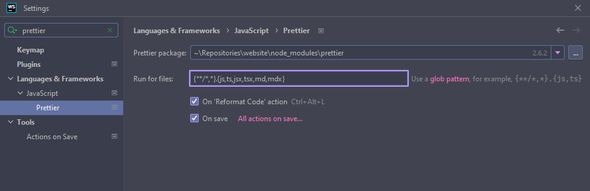

# Contributing

## Code of Conduct

This repository has adopted the Contributor Covenant as it's Code of Conduct. It is expected that
participants adhere to it.

## Proposing a Change

If you are unsure about whether or not a change is desired, you can create an issue. This is useful
because it creates the possibility for a discussion that's visible to everyone.

When fixing a bug it is fine to submit a pull request right away.

## Setup

### Tools

You need the following tools to be installed.

- [Node](https://nodejs.org/) installed at v16.X.
- [Yarn](https://yarnpkg.com/) at v1.22.4+.

> **Tip:** _Use [nvm](https://github.com/nvm-sh/nvm) or [n](https://github.com/tj/n) or
> [nodenv](https://github.com/nodenv/nodenv) to manage Node.js versions on your machine._

### Plugins

Install and enable plugins for your IDE:

- ESLint
- [Prettier](https://prettier.io/) - Enable auto format on save:
  _([WebStorm](https://www.jetbrains.com/help/idea/prettier.html#ws_prettier_configure),
  [PhpStorm](https://www.jetbrains.com/help/idea/prettier.html#ws_prettier_configure),
  [VS Code](https://marketplace.visualstudio.com/items?itemName=esbenp.prettier-vscode#format-on-save))_.

## Sending a Pull Request

Steps to be performed to submit a pull request:

1. Fork the repository and create your branch from `main`.
2. Run `yarn` in the repository root.
3. If you've fixed a bug or added code that should be tested, add tests!
4. Run `yarn build` and make sure no errors are generated in the console before creating the PR.
5. Fill out the description, link any related issues and submit your pull request.

## License

By contributing to this repository, you agree that your contributions will be licensed under its MIT
license.
