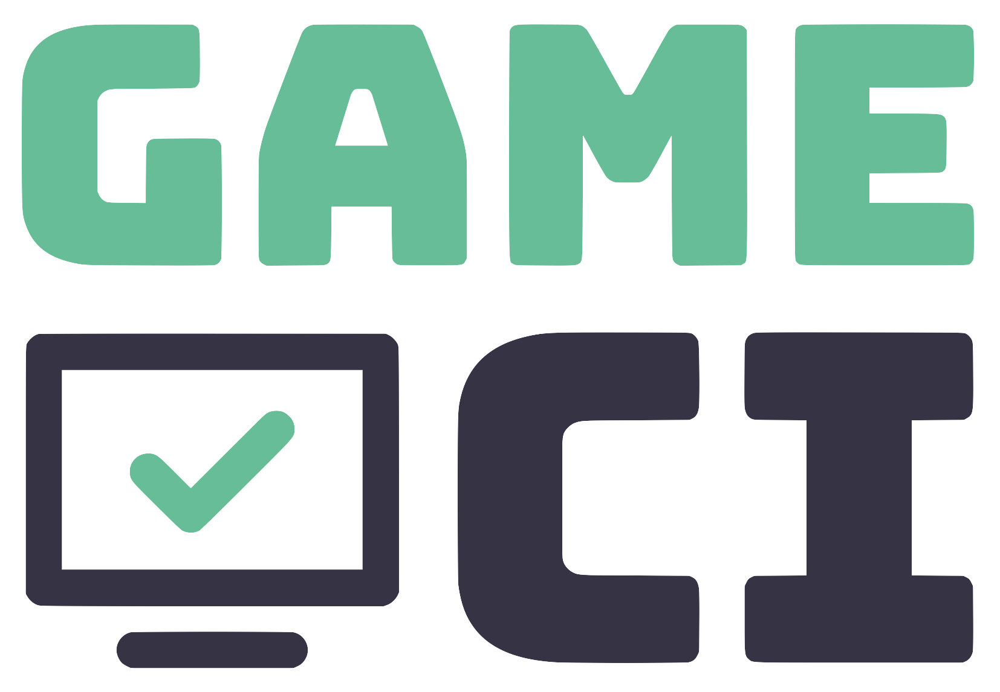

<p align="center">
  
<p>

<p align="center">
  <a href="https://discord.com/invite/WyPN5r9">
    </a>
  <a href="https://opencollective.com/game-ci">
    </a> <br>
  
  
  
<p>

<br>

## Welcome

Welcome to the GameCI documentation repo! Here you will find the documentation assets for GameCI and
it's related open-source projects. The live documentation site available at
<a href="https://game.ci">game.ci</a>.

You may also view the markdown files directly at the following links:

- [Getting Started with GameCI](docs/02-getting-started)
- [GitHub Actions](docs/03-github)
- [GitLab Pipelines](docs/05-gitlab)
- [CircleCi](docs/11-circleci)
- [Docker](docs/08-docker)
- [GitHub Cloud Runner](docs/03-github-cloud-runner)
- [Troubleshooting](docs/09-troubleshooting)
- [FAQ](docs/10-faq)

## Building the Docs Site

Built with [Docusaurus 2](https://docusaurus.io/).

This project has a hard dependency on Node16. You will need to make sure that you have the proper
version of node installed to avoid errors.

- [Install NodeJS v18 on Ubuntu](https://joshtronic.com/2022/04/24/how-to-install-nodejs-18-on-ubuntu-2004-lts/)
- [Install NodeJS v18 using brew](https://apple.stackexchange.com/a/207883)

This project relies on yarn for package management. You will need to install yarn in order to build
and test the documentation site.

- [Official yarn installation docs.](https://classic.yarnpkg.com/lang/en/docs/install)

1.  Install project dependencies

    ```bash
    yarn install
    ```

2.  Start a local development server

    This command starts a local development server and opens up a browser window. Most changes are
    reflected live without having to restart the server.

    ```bash
    yarn start
    ```

3.  Create a build This command generates static content into the `build` directory and can be
    served using any static contents hosting service.

    ```bash
    yarn build
    ```

## Meet the Community

Join us on [Discord](https://game.ci/discord) and engage with the growing community of engineers,
artists, hobbyists, and professionals using GameCI to build, test, and publish their projects
everyday.

## Support the Team

GameCI is free for everyone forever. You can support the people who make GameCI possible on
[OpenCollective](https://opencollective.com/game-ci)

## License

This repository is [MIT](./LICENSE) licensed. This includes all contributions from the community.
