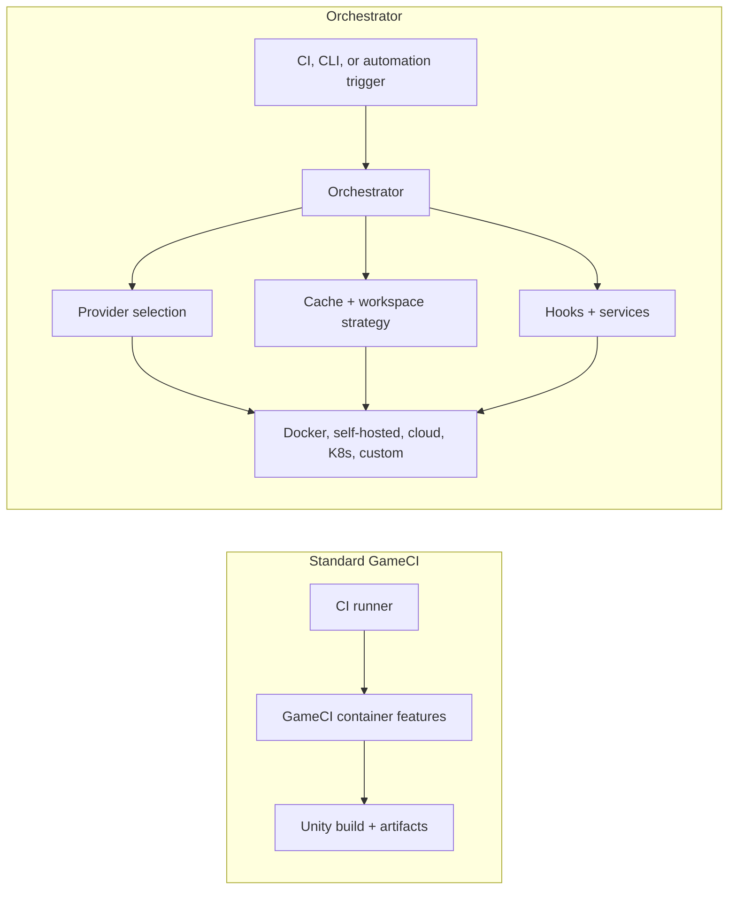

# Introduction

GameCI has two layers that work together.

**Standard GameCI** is the clean foundation: container-based Unity builds, essential license and
platform setup, predictable inputs, artifacts, and CI-friendly defaults. It stays minimal on
purpose. If your project fits comfortably on a GitHub-hosted runner, GitLab runner, CircleCI runner,
or one self-hosted machine, standard GameCI is usually the best starting point.

**Orchestrator** is the advanced automation layer. It adds provider logic, workspace and cache
strategy, runner routing, async execution, hooks, cleanup, and build-farm behavior on top of the
same GameCI build foundation. Use it when the build is no longer just "run a container here" and
becomes "choose the best machine, prepare the workspace efficiently, run reliably, and return
outputs."

## What Standard GameCI Gives You

Standard GameCI exposes the essential build functionality without forcing an infrastructure model on
you.

| Area             | Standard GameCI behavior                                                                     |
| ---------------- | -------------------------------------------------------------------------------------------- |
| Container builds | Uses GameCI Unity editor containers for repeatable builds.                                   |
| License setup    | Activates, uses, and returns Unity licenses through action inputs and environment variables. |
| Platform setup   | Prepares common Unity target platforms and build parameters.                                 |
| Cache basics     | Works with the CI platform cache and local runner state.                                     |
| Artifacts        | Produces build outputs that normal CI steps can upload.                                      |
| Workflow shape   | Keeps YAML small and easy to reason about.                                                   |

This is intentionally unbloated. It gives teams a stable foundation that is easy to adopt, easy to
debug, and close to the standard CI model.

## What Orchestrator Adds

Orchestrator specializes CI and automation for large or demanding game projects.

| Area                    | What Orchestrator adds                                                                                        |
| ----------------------- | ------------------------------------------------------------------------------------------------------------- |
| Provider unification    | One workflow model across Docker, local system, self-hosted runners, cloud, Kubernetes, and custom providers. |
| Advanced caching        | S3/rclone caches, checkpoints, retained workspaces, cache fallback, and failure-aware cache saving.           |
| Workspace optimization  | Git/LFS preparation, submodule handling, large-project paths, and streaming hot runner sync.                  |
| Load balancing          | Provider fallback, runner checks, capacity routing, and burst behavior.                                       |
| Async execution         | Builds can continue on provider infrastructure after the dispatcher job returns.                              |
| Hooks and services      | Command hooks, container hooks, middleware, storage services, LFS agents, and custom jobs.                    |
| Game-specific workflows | Hot runners, test workflow execution, engine plugins, artifact manifests, and structured outputs.             |
| Cleanup and reliability | Locks, retries, resource cleanup, garbage collection, and provider health checks.                             |

Orchestrator is not meant to replace the simple path. It exists for projects where build time, cache
size, runner availability, hardware needs, or infrastructure consistency have become real
engineering problems.

:::info Built into Unity Builder

For GitHub Actions, Orchestrator is available through
[`game-ci/unity-builder`](https://github.com/game-ci/unity-builder). It activates when you choose a
non-local `providerStrategy` or enable Orchestrator-backed services. You do not need a separate
standalone install for normal GitHub Actions usage.

The standalone [`@game-ci/orchestrator`](https://github.com/game-ci/orchestrator) CLI remains useful
for provider development, debugging, and direct backend usage.

:::

## Common Starting Points

| Goal                                   | Start here                                                                |
| -------------------------------------- | ------------------------------------------------------------------------- |
| Decide whether you need Orchestrator   | [GameCI vs Orchestrator](game-ci-vs-orchestrator)                         |
| Run a normal Unity build on AWS or K8s | [Getting Started](getting-started)                                        |
| Run from a terminal                    | [GameCI CLI](/docs/cli)                                                   |
| Choose a provider                      | [Providers](../providers/overview)                                        |
| Tune cache behavior                    | [Caching](../advanced-topics/caching)                                     |
| Keep whole workspaces warm             | [Retained Workspaces](../advanced-topics/retained-workspace)              |
| Stream jobs to warm runners            | [Standalone Streaming Hot Runner](../advanced-topics/hot-runner-protocol) |
| Route across providers                 | [Load Balancing](../advanced-topics/load-balancing)                       |
| Add custom build steps                 | [Hooks](../advanced-topics/hooks/container-hooks)                         |
| Look up inputs                         | [API Reference](../api-reference)                                         |

## Providers

| Provider                                  | Description                                              |
| ----------------------------------------- | -------------------------------------------------------- |
| [AWS Fargate](../providers/aws)           | Fully managed containers on AWS. No servers to maintain. |
| [Kubernetes](../providers/kubernetes)     | Run jobs on any Kubernetes cluster.                      |
| [Local Docker](../providers/local-docker) | Run the same container workflow on a local machine.      |
| [Local](../providers/local)               | Execute directly on the host machine.                    |

Additional provider integrations include [GCP Cloud Run](../providers/gcp-cloud-run),
[Azure ACI](../providers/azure-aci), [custom providers](../providers/custom-providers), and
[community providers](../providers/community-providers).

## When It Helps Most

- Unity import, Library cache restore, or LFS pulls dominate build time.
- Hosted runner CPU, memory, disk, GPU, or timeout limits are too small.
- Self-hosted runners need shared cache, locks, fallback, or cleanup.
- The same workflow should run on Docker locally, owned hardware, and cloud providers.
- Builds should keep running asynchronously after the CI dispatcher exits.
- Teams need custom hooks, storage backends, hot runners, or game-specific test workflows.

If the build is fast and reliable on a standard runner, keep using standard GameCI. Move to
Orchestrator when infrastructure and performance need a dedicated automation layer.

## External Links

- [Orchestrator repository](https://github.com/game-ci/orchestrator) - standalone orchestrator
  package
- [Releases](https://github.com/game-ci/orchestrator/releases) - orchestrator releases
- [Issues](https://github.com/game-ci/orchestrator/issues) - bugs and feature requests
- [Discord](https://discord.com/channels/710946343828455455/789631903157583923) - community chat
