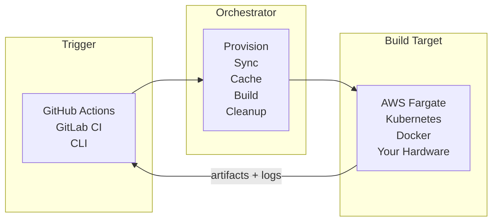

# Introduction

Orchestrator runs GameCI builds on the infrastructure you choose instead of forcing the build to run
on the CI runner that started the workflow. A GitHub Action, CLI command, or another CI system can
dispatch the job; Orchestrator then provisions the target environment, syncs the project, restores
caches, runs the build, uploads outputs, and cleans up.

Use it when you need more control than a standard hosted runner gives you: larger CPU and memory
profiles, persistent workspaces, cloud burst capacity, provider fallback, custom hooks, or build
jobs that should continue after the CI runner has returned.

:::info Built into Unity Builder

For GitHub Actions, Orchestrator is built into
[`game-ci/unity-builder`](https://github.com/game-ci/unity-builder) and activates when you set
`providerStrategy`. The standalone
[`@game-ci/orchestrator`](https://github.com/game-ci/orchestrator) CLI provides the same model
outside GitHub Actions.

:::

## What It Handles

| Area               | What Orchestrator does                                                                  |
| ------------------ | --------------------------------------------------------------------------------------- |
| Provider lifecycle | Creates cloud jobs, containers, Kubernetes jobs, local Docker runs, or custom providers |
| Source sync        | Clones git, pulls LFS, initializes submodules, and supports advanced sync strategies    |
| Caching            | Restores and saves Library, LFS, build output, checkpoints, and retained workspaces     |
| Build execution    | Runs Unity builds, custom editor methods, tests, or custom container jobs               |
| Hooks and services | Injects command hooks, container hooks, LFS agents, storage hooks, and build services   |
| Secrets            | Pulls secrets from CI inputs, cloud secret managers, vaults, or custom commands         |
| Results            | Streams logs, uploads artifacts, updates GitHub Checks, and supports async jobs         |
| Cleanup            | Releases locks, removes stale resources, and supports scheduled garbage collection      |

## Common Starting Points

| Goal                                     | Start here                                                   |
| ---------------------------------------- | ------------------------------------------------------------ |
| Run a normal Unity build on AWS or K8s   | [Getting Started](getting-started)                           |
| Compare standard GameCI and Orchestrator | [GameCI vs Orchestrator](game-ci-vs-orchestrator)            |
| Run from a terminal                      | [CLI](../cli/getting-started)                                |
| Choose a provider                        | [Providers](../providers/overview)                           |
| Tune cache behavior                      | [Caching](../advanced-topics/caching)                        |
| Keep whole workspaces warm               | [Retained Workspaces](../advanced-topics/retained-workspace) |
| Add custom build steps                   | [Hooks](../advanced-topics/hooks/container-hooks)            |
| Look up inputs                           | [API Reference](../api-reference)                            |

## Providers

| Provider                                  | Description                                              |
| ----------------------------------------- | -------------------------------------------------------- |
| [AWS Fargate](../providers/aws)           | Fully managed containers on AWS. No servers to maintain. |
| [Kubernetes](../providers/kubernetes)     | Run jobs on any Kubernetes cluster.                      |
| [Local Docker](../providers/local-docker) | Run the same container workflow on a local machine.      |
| [Local](../providers/local)               | Execute directly on the host machine.                    |

Additional provider integrations include [GCP Cloud Run](../providers/gcp-cloud-run),
[Azure ACI](../providers/azure-aci), [custom providers](../providers/custom-providers), and
[community providers](../providers/community-providers).

## When It Helps Most

- Your Unity Library import is too slow for a hosted runner cache.
- Your project needs more CPU, memory, disk, or timeout control than the CI runner provides.
- You want builds to continue asynchronously after GitHub Actions dispatches them.
- You maintain self-hosted runners but need fallback when they are busy or offline.
- Your pipeline needs provider-specific hooks, storage backends, custom LFS agents, or retained
  workspaces.

If your project builds comfortably on standard hosted runners and does not need these controls,
standard GameCI may be simpler. See [GameCI vs Orchestrator](game-ci-vs-orchestrator) for the
decision guide.

## External Links

- [Orchestrator Repository](https://github.com/game-ci/orchestrator) - standalone orchestrator
  package
- [Releases](https://github.com/game-ci/orchestrator/releases) - orchestrator releases
- [Issues](https://github.com/game-ci/orchestrator/issues) - bugs and feature requests
- [Discord](https://discord.com/channels/710946343828455455/789631903157583923) - community chat
