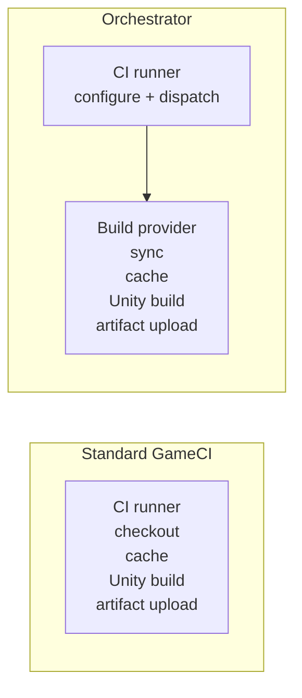

# GameCI vs Orchestrator

Standard GameCI and Orchestrator use the same GameCI foundation, but they put the build in different
places.

- **Standard GameCI** runs directly on the CI runner that executes the workflow step.
- **Orchestrator** uses the CI runner as a dispatcher and runs the build on a provider such as AWS,
  Kubernetes, Local Docker, local hardware, or a custom provider.

## Quick Decision

| Choose this                    | When                                                                |
| ------------------------------ | ------------------------------------------------------------------- |
| Standard GameCI                | Hosted runner resources are enough and simple workflow YAML is best |
| Orchestrator with cloud        | You need larger resources, async builds, or scale-to-zero runners   |
| Orchestrator with local Docker | You want local parity before moving the same workflow to cloud      |
| Orchestrator with self-hosting | You own hardware but need locks, fallback, cache survival, or hooks |

## Comparison

| Area             | Standard GameCI                  | Orchestrator                                           |
| ---------------- | -------------------------------- | ------------------------------------------------------ |
| Build location   | The current CI runner            | A selected provider target                             |
| Setup complexity | Lowest                           | Higher; provider credentials and storage may be needed |
| Resource control | Limited to runner size           | Configure CPU, memory, disk, provider, and timeout     |
| Caching          | CI cache or local runner cache   | S3/rclone cache, checkpoints, retained workspaces      |
| Long builds      | Tied to CI job timeout           | Can run async after dispatch                           |
| Self-hosted use  | Runner does everything           | Runner can dispatch, fallback, or host local provider  |
| Customization    | Workflow steps around the action | Lifecycle hooks, custom jobs, provider plugins         |
| Best fit         | Small to medium Unity projects   | Large, slow, flaky, or infrastructure-sensitive builds |

## Self-Hosted Runners and Orchestrator

Self-hosted runners and Orchestrator are complementary. A self-hosted runner by itself is just a
machine that GitHub can schedule. Orchestrator adds build lifecycle behavior on top of that machine:
workspace locking, cache storage, fallback routing, cleanup, and hooks.

| Need                                     | Self-hosted runner alone | Self-hosted plus Orchestrator              |
| ---------------------------------------- | ------------------------ | ------------------------------------------ |
| Use owned hardware                       | Yes                      | Yes                                        |
| Fall back when the runner is busy        | Manual                   | Route to an alternate provider             |
| Keep large workspaces warm safely        | Manual scripting         | Retained workspaces with distributed locks |
| Share cache with cloud builds            | Manual                   | S3/rclone cache backend                    |
| Run identical workflow locally and cloud | Difficult                | Use Local Docker, then switch provider     |

## Migration Path

1. Start with standard GameCI while the project fits hosted runner limits.
2. Move to [Local Docker](../providers/local-docker) if you want Orchestrator behavior without cloud
   setup.
3. Add [caching](../advanced-topics/caching) and
   [retained workspaces](../advanced-topics/retained-workspace) when import time becomes the
   bottleneck.
4. Move the provider to [AWS](../providers/aws) or [Kubernetes](../providers/kubernetes) when you
   need elastic capacity.
5. Add [load balancing](../advanced-topics/load-balancing) when self-hosted capacity and cloud
   fallback need to work together.
