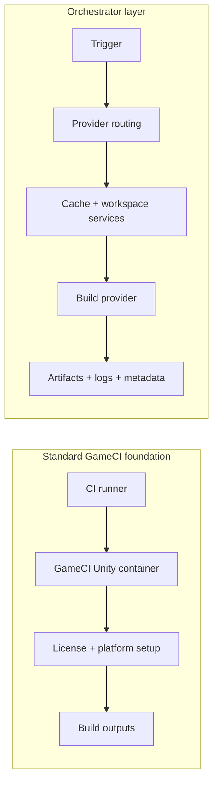

# GameCI vs Orchestrator

Standard GameCI and Orchestrator are not competing products. They are two levels of the same build
system.

Standard GameCI is the minimal, container-focused foundation. It exposes the essential build
features clearly and keeps the CI workflow close to the platform you already use. Unity is the
primary maintained built-in package, while other engines have built-in configurations and new
engines can be added through the CLI and Orchestrator plugin model.

Orchestrator builds on that foundation when a project needs advanced automation: richer caching,
warm workspaces, provider abstraction, runner coordination, load balancing, custom hooks, async
execution, and game-specific performance features. Those benefits are not limited to multi-machine
setups; a single host with multiple runners, multiple projects, or expensive cache reuse can also
benefit.

## Quick Decision

| Choose this                    | When                                                                                    |
| ------------------------------ | --------------------------------------------------------------------------------------- |
| Standard GameCI                | You want the simplest reliable container build path.                                    |
| Standard GameCI on self-hosted | One simple runner is enough and you can manage its state yourself.                      |
| Orchestrator with local Docker | You want Orchestrator behavior locally, including cache and workspace services.         |
| Orchestrator with self-hosting | Owned runners or projects need locks, fallback, cleanup, warm workspaces, shared cache. |
| Orchestrator with cloud or K8s | You need larger resources, elastic capacity, async jobs, or provider unification.       |

## Standard GameCI

Standard GameCI is deliberately clean and minimal.

It gives you:

- Unity editor containers maintained by GameCI, as the primary built-in package
- License activation and return behavior for engines that need it
- Build target and platform setup
- Build method and custom parameter handling
- CI-native cache and artifact compatibility
- Workflow steps that are easy to audit and debug

This path is ideal when the CI runner is the right place to build. You get the standard container
features and essential functionality without adopting a build orchestration system.

## Orchestrator

Orchestrator is for teams whose build pipeline has become an automation, performance, or
infrastructure problem.

It adds:

- Provider unification across local Docker, local system, self-hosted runners, AWS, Kubernetes, GCP,
  Azure, GitHub Actions dispatch, GitLab CI dispatch, Ansible, Remote PowerShell, and custom
  providers
- Advanced caching behavior across S3, rclone, retained workspaces, checkpoints, and fallback keys
- Large-project workspace preparation, Git LFS handling, submodule profiles, and child workspaces
- Load balancing, provider fallback, runner availability checks, and burst capacity
- Standalone streaming hot runners for warm editor and workspace workflows
- Hooks, middleware, custom jobs, storage services, LFS agents, and structured build outputs
- Cleanup, locking, retries, garbage collection, and other reliability services

The tradeoff is complexity. You should choose it because the build needs those capabilities, not
because every project needs orchestration by default.

## Comparison

| Area             | Standard GameCI                                 | Orchestrator                                                              |
| ---------------- | ----------------------------------------------- | ------------------------------------------------------------------------- |
| Philosophy       | Minimal, stable, container-first foundation     | Advanced automation and provider coordination                             |
| Build location   | The current CI runner                           | A selected provider target                                                |
| Setup complexity | Lowest                                          | Higher; provider credentials and storage may be needed                    |
| Resource control | Limited to the runner                           | Configure CPU, memory, disk, provider, timeout, and fallback              |
| Caching          | CI cache or local runner cache                  | S3/rclone cache, checkpoints, retained workspaces, cache survival         |
| Workspace model  | Fresh checkout or runner-local state            | Clone, sync, retained workspace, child workspace, or streaming hot runner |
| Long builds      | Tied to CI job timeout                          | Can run async after dispatch                                              |
| Self-hosted use  | Runner does everything                          | Runner can dispatch, host providers, or participate in fallback           |
| Customization    | Workflow steps around the action                | Lifecycle hooks, custom jobs, provider plugins, middleware                |
| Best fit         | Small to medium projects and straightforward CI | Large, slow, flaky, or infrastructure-sensitive builds                    |

## Self-Hosted Runners

Self-hosted runners and Orchestrator are complementary.

A self-hosted runner alone gives you owned hardware. Orchestrator adds coordination behavior on top
of owned hardware: workspace locking, cache services, fallback routing, cleanup, hooks, and provider
parity with cloud builds. That can help even when all runners are on one host or when each project
has only one runner but the host should preserve expensive caches across builds.

| Need                                     | Self-hosted runner alone | Self-hosted plus Orchestrator              |
| ---------------------------------------- | ------------------------ | ------------------------------------------ |
| Use owned hardware                       | Yes                      | Yes                                        |
| Keep the workflow minimal                | Yes                      | No, Orchestrator adds a service layer      |
| Fall back when the runner is busy        | Manual                   | Route to an alternate provider             |
| Keep large workspaces warm safely        | Manual scripting         | Retained workspaces with distributed locks |
| Share cache with cloud builds            | Manual                   | S3/rclone cache backend                    |
| Run identical workflow locally and cloud | Difficult                | Use Local Docker, then switch provider     |
| Coordinate a runner pool                 | Manual                   | Runner checks, routing, and load balancing |

## Migration Path

1. Start with standard GameCI while the project fits runner limits.
2. Move to [Local Docker](../providers/local-docker) if you want Orchestrator behavior without cloud
   setup.
3. Add [caching](../advanced-topics/caching) and
   [retained workspaces](../advanced-topics/caching#retained-workspaces) when import time becomes
   the bottleneck.
4. Add [Standalone Streaming Hot Runner](../advanced-topics/hot-runner-protocol) when warm editor
   iteration matters.
5. Move the provider to [AWS](../providers/aws) or [Kubernetes](../providers/kubernetes) when you
   need elastic capacity.
6. Add [load balancing](../advanced-topics/load-balancing) when self-hosted capacity and cloud
   fallback need to work together.

## Rule Of Thumb

Use standard GameCI until the simple model becomes the bottleneck. Use Orchestrator when you need to
specialize CI and automation around the realities of game development: big assets, expensive
imports, long builds, shared caches, retained workspaces, scarce hardware, multiple runners,
multiple providers, and teams that need consistent behavior across all of them.
