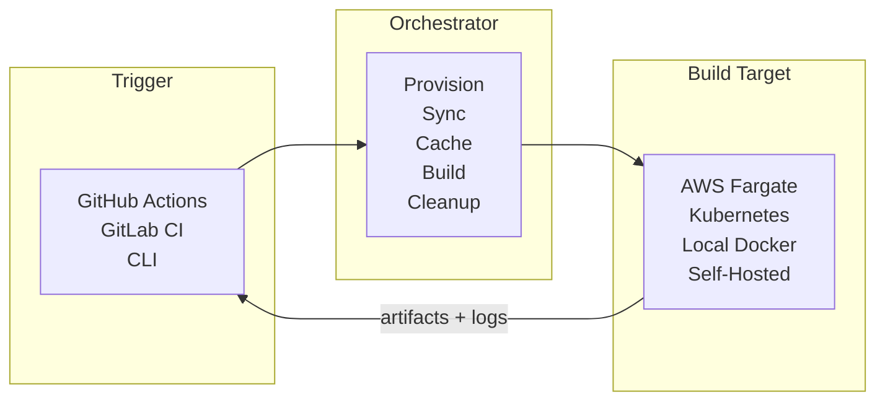

# Introduction

## What Does Orchestrator Do?

**Orchestrator is an advanced build layer on top of
[Game CI unity-builder](https://github.com/game-ci/unity-builder).** It dispatches Unity builds to
cloud infrastructure, self-hosted runners, or local Docker containers instead of running them
directly on your CI runner. Start jobs from GitHub Actions, the command line, or any CI system.
Orchestrator provisions the environment, syncs your project, runs the build, and streams results
back.

:::info Built-in and Standalone

The orchestrator is built into [`game-ci/unity-builder`](https://github.com/game-ci/unity-builder)
and activates automatically when you set `providerStrategy`. It is also available as a
[standalone CLI](https://github.com/game-ci/orchestrator) for use outside GitHub Actions.

:::

## Why Orchestrator?

Orchestrator benefits projects of any size. Even small projects gain access to configurable
resources, caching, and cost-efficient scaling. Larger projects get retained workspaces, automatic
failover, and multi-provider load balancing.

| Benefit                    | What it means                                                                                                                    |
| -------------------------- | -------------------------------------------------------------------------------------------------------------------------------- |
| **Configurable resources** | Set CPU, memory, and disk per build instead of accepting CI runner defaults                                                      |
| **Scale from zero**        | No idle servers. Cloud providers provision on demand and tear down when done                                                     |
| **Retained workspaces**    | Cache the entire project folder across builds for faster rebuilds on large projects                                              |
| **Automatic caching**      | Unity Library, LFS objects, and build output cached to S3 or 70+ backends via rclone                                             |
| **Provider failover**      | Automatically route to a fallback provider when the primary is unavailable or overloaded                                         |
| **Extensible**             | Run [custom hooks](advanced-topics/hooks/container-hooks), middleware, or your own [provider plugin](providers/custom-providers) |
| **Self-hosted friendly**   | Complements self-hosted runners with automatic fallback, load balancing, and runner availability checks                          |

## When You Might Not Need It

- Your project fits comfortably on standard GitHub runners and you don't need caching, hooks, or
  custom resources
- You already have a fully managed build pipeline that meets your needs

See [Standard Game-CI vs Orchestrator](game-ci-vs-orchestrator) for a detailed comparison.

## What Orchestrator Handles

Orchestrator manages the full build lifecycle so you don't have to script it yourself:

- **Provisioning** - creates cloud resources (CloudFormation stacks, Kubernetes jobs, Docker
  containers) and tears them down after the build
- **Git sync** - clones your repo with configurable depth, pulls LFS objects, initializes
  submodules, and handles SSH/HTTP auth
- **Caching** - persists the Unity Library folder, LFS objects, and build output across builds using
  S3 or rclone
- **Hooks** - inject custom containers or shell commands at any point in the build lifecycle with
  phase, provider, and platform filtering
- **Secrets** - pulls secrets from AWS Secrets Manager, GCP Secret Manager, Azure Key Vault, or
  HashiCorp Vault and injects them as environment variables
- **Logging** - streams structured build logs in real-time via Kinesis (AWS), kubectl (K8s), or
  stdout (local)
- **Cleanup** - removes cloud resources, temporary files, and expired caches automatically

## Supported Providers

| Provider                               | Description                                              |
| -------------------------------------- | -------------------------------------------------------- |
| [AWS Fargate](providers/aws)           | Fully managed containers on AWS. No servers to maintain. |
| [Kubernetes](providers/kubernetes)     | Run on any Kubernetes cluster.                           |
| [Local Docker](providers/local-docker) | Docker containers on the local machine.                  |
| [Local](providers/local)               | Direct execution on the host machine.                    |

See [Providers](providers/overview) for the full list including
[GCP Cloud Run](providers/gcp-cloud-run), [Azure ACI](providers/azure-aci),
[custom](providers/custom-providers), and [community](providers/community-providers) providers.

## Supported Platforms

| Platform                                       | Description                           |
| ---------------------------------------------- | ------------------------------------- |
| [GitHub Actions](providers/github-integration) | First-class support with Checks API.  |
| [GitLab CI](providers/gitlab-integration)      | Via the command line mode.            |
| [Command Line](examples/command-line)          | Run from any terminal or script.      |
| Any CI system                                  | Anything that can run shell commands. |

## External Links

- [Orchestrator Repository](https://github.com/game-ci/orchestrator) - standalone orchestrator
  package
- [Releases](https://github.com/game-ci/orchestrator/releases) - orchestrator releases
- [Pull Requests](https://github.com/game-ci/orchestrator/pulls) - open orchestrator PRs
- [Issues](https://github.com/game-ci/orchestrator/issues) - bugs and feature requests
- [Discord](https://discord.com/channels/710946343828455455/789631903157583923) - community chat
- [Feedback Form](https://forms.gle/3Wg1gGf9FnZ72RiJ9) - share your experience
