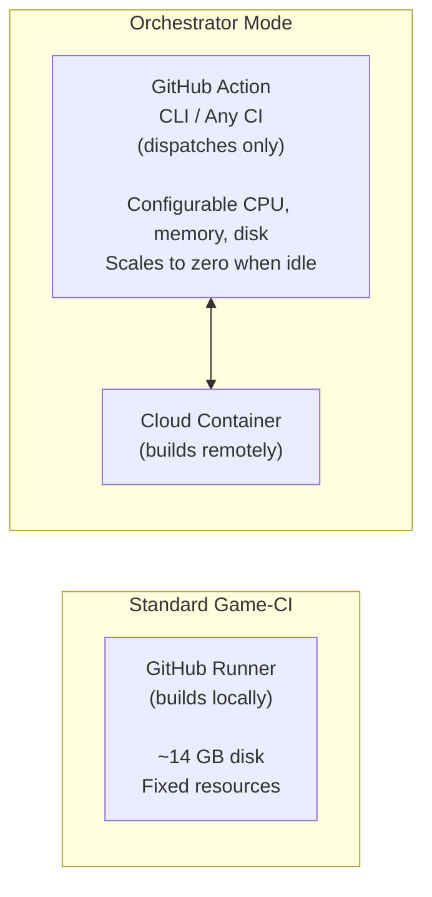

# Standard Game-CI vs Orchestrator Mode

## Standard Game-CI

Game CI provides Docker images and GitHub Actions for running Unity workflows on the build server
resources provided by your CI platform (GitHub, GitLab, Circle CI).

**Best for:** Projects that fit within your CI runner's resource limits and don't need advanced
caching, hooks, or multi-provider routing.

## Orchestrator Mode

Orchestrator is an advanced layer on top of Game CI. It dispatches builds to cloud infrastructure
(AWS Fargate, Kubernetes), local Docker containers, or self-hosted runners, and manages the full
build lifecycle: provisioning, git sync, caching, hooks, and cleanup.

Projects of any size can benefit from orchestrator features like configurable resources, automatic
caching, and extensible hooks. Larger projects additionally benefit from retained workspaces,
provider failover, and load balancing.

## Self-Hosted Runners + Orchestrator

Self-hosted runners and orchestrator are not mutually exclusive. Orchestrator **complements**
self-hosted runners by adding automatic failover, load balancing, and runner availability checks.

|                    | Self-Hosted Runners Alone           | Self-Hosted + Orchestrator                             |
| ------------------ | ----------------------------------- | ------------------------------------------------------ |
| **Failover**       | Manual intervention if server fails | Automatic fallback to cloud when runner is unavailable |
| **Load balancing** | Fixed capacity                      | Overflow to cloud during peak demand                   |
| **Caching**        | Local disk only                     | S3/rclone-backed caching with retained workspaces      |
| **Hooks**          | Custom scripting                    | Built-in middleware pipeline with lifecycle hooks      |
| **Maintenance**    | You manage everything               | Orchestrator handles provisioning, sync, and cleanup   |

## Choosing Your Setup

| Scenario                                       | Recommendation                                                    |
| ---------------------------------------------- | ----------------------------------------------------------------- |
| Small project, standard runners work fine      | Standard Game-CI                                                  |
| Need configurable resources or caching         | Orchestrator with any provider                                    |
| Large project, no existing servers             | Orchestrator with AWS Fargate or Kubernetes                       |
| Existing self-hosted runners, want reliability | Orchestrator with self-hosted primary + cloud fallback            |
| Want to test orchestrator locally before cloud | Orchestrator with [Local Docker](providers/local-docker) provider |
