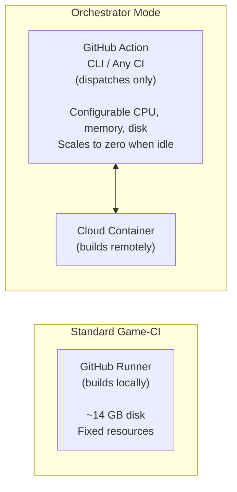

# Standard Game-CI vs Orchestrator Mode

## 🎮 Standard Game-CI

Game CI provides Docker images and GitHub Actions for running Unity workflows on the build server
resources provided by your CI platform (GitHub, GitLab, Circle CI).

**Best for:** Small to medium projects that fit within GitHub's resource limits.

## ☁️ Orchestrator Mode

Orchestrator sends builds to cloud infrastructure (AWS Fargate, Kubernetes) instead of running on
the CI runner itself. This is useful when:

- Your project **exceeds disk space limits** on GitHub-hosted runners
- You need **more CPU or memory** than the CI platform provides
- You want to **scale to many concurrent builds** without managing servers

## Self-Hosted Runners vs Orchestrator

Both options let you build larger projects. Here's when to pick which:

|                 | Self-Hosted Runners                | Orchestrator                          |
| --------------- | ---------------------------------- | ------------------------------------- |
| **Setup**       | Requires a dedicated server        | Cloud account + credentials           |
| **Maintenance** | You manage the server 24/7         | Fully managed, no servers to maintain |
| **Cost model**  | Fixed (server always running)      | Pay per build (scales to zero)        |
| **Best for**    | Teams with existing infrastructure | Teams without dedicated servers       |
