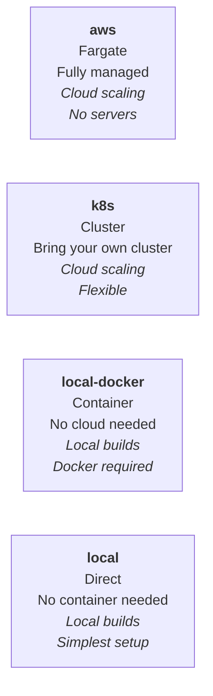

# Providers

A **provider** is the backend that Orchestrator uses to run your builds. You choose a provider by
setting the `providerStrategy` parameter.

## Built-in Providers

These providers ship with Orchestrator and are maintained by the Game CI team.

| Provider       | `providerStrategy` | Description                                                                   |
| -------------- | ------------------ | ----------------------------------------------------------------------------- |
| AWS Fargate    | `aws`              | Runs jobs on AWS Fargate (ECS). Fully managed, no servers to maintain.        |
| Kubernetes     | `k8s`              | Runs jobs on any Kubernetes cluster. Flexible but requires a running cluster. |
| Local Docker   | `local-docker`     | Runs jobs in Docker containers on the local machine.                          |
| Local (direct) | `local`            | Runs jobs directly on the local machine without containers.                   |

Each provider has its own page with setup instructions:

- [AWS Fargate](aws)
- [Kubernetes](kubernetes)
- [Local Docker](local-docker)
- [Local](local)

## Dispatch Providers

Route builds to external CI systems instead of running them directly.

- [GitHub Actions Dispatch](github-actions-dispatch) - trigger a GitHub Actions workflow
- [GitLab CI Dispatch](gitlab-ci-dispatch) - trigger a GitLab CI pipeline

## Experimental Providers

These providers are under active development. APIs and behavior may change between releases.

- [GCP Cloud Run](gcp-cloud-run) - serverless containers on Google Cloud
- [Azure ACI](azure-aci) - serverless containers on Azure

## Additional Providers

- [Ansible](ansible) - provision and run builds via Ansible playbooks
- [Remote PowerShell](remote-powershell) - execute builds on remote Windows machines

## Custom Providers

Extend Orchestrator with your own provider by pointing `providerStrategy` at a GitHub repository,
NPM package, or local file path.

See [Custom Providers](custom-providers) for the full guide.

## Community Providers

Third-party providers shared by the Game CI community.

See the [Community Providers](community-providers) page for the current list and how to submit your
own.
