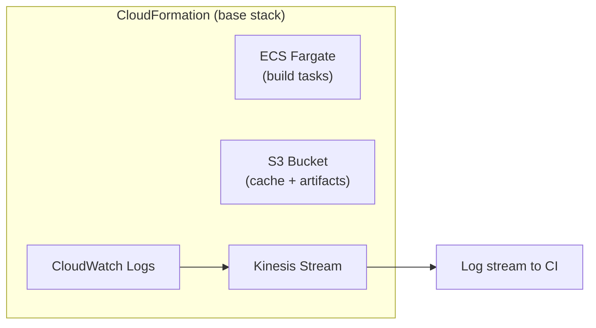

# AWS

## Architecture

Orchestrator creates and manages these AWS resources automatically:



## Requirements

- An AWS account with permission to create resources (ECS, CloudFormation, S3, Kinesis, CloudWatch).
- An IAM user or role with an access key and secret key.

## AWS Credentials

Set the following as `env` variables in your workflow:

| Variable                | Description                                             |
| ----------------------- | ------------------------------------------------------- |
| `AWS_ACCESS_KEY_ID`     | IAM access key ID.                                      |
| `AWS_SECRET_ACCESS_KEY` | IAM secret access key.                                  |
| `AWS_DEFAULT_REGION`    | AWS region matching your base stack (e.g. `eu-west-2`). |

If you're using GitHub Actions, configure credentials with:

```yaml
- name: Configure AWS Credentials
  uses: aws-actions/configure-aws-credentials@v4
  with:
    aws-access-key-id: ${{ secrets.AWS_ACCESS_KEY_ID }}
    aws-secret-access-key: ${{ secrets.AWS_SECRET_ACCESS_KEY }}
    aws-region: eu-west-2
```

## CPU and Memory

AWS Fargate only accepts specific CPU/memory combinations. Values use the format `1024 = 1 vCPU` or
`1 GB`. Do not include the vCPU or GB suffix.

See the full list:
[AWS Fargate Task Definitions](https://docs.aws.amazon.com/AmazonECS/latest/developerguide/task_definition_parameters.html#task_size)

Common combinations:

| CPU (`containerCpu`) | Memory (`containerMemory`) |
| -------------------- | -------------------------- |
| `256` (0.25 vCPU)    | `512`, `1024`, `2048`      |
| `512` (0.5 vCPU)     | `1024` – `4096`            |
| `1024` (1 vCPU)      | `2048` – `8192`            |
| `2048` (2 vCPU)      | `4096` – `16384`           |
| `4096` (4 vCPU)      | `8192` – `30720`           |

## Example Workflow

```yaml
- uses: game-ci/unity-builder@v4
  id: aws-fargate-unity-build
  with:
    providerStrategy: aws
    versioning: None
    projectPath: path/to/your/project
    unityVersion: 2022.3.0f1
    targetPlatform: ${{ matrix.targetPlatform }}
    gitPrivateToken: ${{ secrets.GITHUB_TOKEN }}
    containerCpu: 1024
    containerMemory: 4096
    # Export builds to S3:
    containerHookFiles: aws-s3-upload-build
```

See [Container Hooks](../advanced-topics/hooks/container-hooks) for more on `containerHookFiles`.

A full workflow example is available in the builder source:
[orchestrator-pipeline.yml](https://github.com/game-ci/unity-builder/blob/main/.github/workflows/orchestrator-pipeline.yml).

## Limitations

### Container Override Size (8192 bytes)

AWS ECS/Fargate limits the `containerOverrides` payload to 8192 bytes. This payload includes all
build environment variables, secrets, and the build command. Complex workflows with many custom
parameters or large secret values can exceed this limit, producing the error:

```plaintext
Container Overrides length must be at most 8192
```

To reduce payload size, use the orchestrator's built-in
[secret pulling](/docs/github-orchestrator/secrets) to fetch secrets at runtime instead of passing
them inline:

```yaml
env:
  pullInputList: UNITY_LICENSE,UNITY_SERIAL,UNITY_EMAIL,UNITY_PASSWORD
  secretSource: aws-secrets-manager
```

See
[Troubleshooting: Container Overrides](/docs/troubleshooting/common-issues#container-overrides-length-must-be-at-most-8192-aws)
for more details.

## AWS Parameters

For the full list of AWS-specific parameters (`awsStackName`, endpoint overrides, etc.), see the
[API Reference - AWS section](../api-reference#aws).
