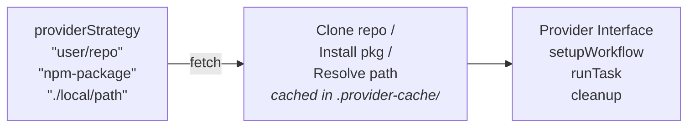

# Custom Providers

Orchestrator uses a plugin system that lets you extend it with custom providers. A **provider** is a
pluggable backend that controls where and how jobs run. Built-in providers include `aws`, `k8s`,
`local-docker`, and `local`.

This page covers TypeScript and JavaScript provider modules loaded from a GitHub repository, NPM
package, or local path. If you only need a YAML or JSON file that maps lifecycle operations to shell
commands, use [Config-Defined Providers](config-defined-providers). If you want to write provider
logic in another language as an executable, use the [CLI Provider Protocol](cli-provider-protocol).



## Using a Custom Provider

Set `providerStrategy` to a provider source instead of a built-in name:

```yaml
# GitHub repository
- uses: game-ci/unity-builder@v4
  with:
    providerStrategy: 'https://github.com/your-org/my-provider'
    targetPlatform: StandaloneLinux64

# GitHub shorthand
- uses: game-ci/unity-builder@v4
  with:
    providerStrategy: 'your-org/my-provider'
    targetPlatform: StandaloneLinux64

# Specific branch
- uses: game-ci/unity-builder@v4
  with:
    providerStrategy: 'your-org/my-provider@develop'
    targetPlatform: StandaloneLinux64
```

### Supported Source Formats

| Format                                | Example                                                  |
| ------------------------------------- | -------------------------------------------------------- |
| GitHub HTTPS URL                      | `https://github.com/user/repo`                           |
| GitHub URL with branch                | `https://github.com/user/repo/tree/main`                 |
| GitHub URL with branch and path       | `https://github.com/user/repo/tree/main/src/my-provider` |
| GitHub shorthand                      | `user/repo`                                              |
| GitHub shorthand with branch          | `user/repo@develop`                                      |
| GitHub shorthand with branch and path | `user/repo@develop/src/my-provider`                      |
| GitHub SSH                            | `git@github.com:user/repo.git`                           |
| NPM package                           | `my-provider-package`                                    |
| Scoped NPM package                    | `@scope/my-provider`                                     |
| Local relative path                   | `./my-local-provider`                                    |
| Local absolute path                   | `/path/to/provider`                                      |

## Creating a Custom Provider

A provider is a module that exports a class implementing the `ProviderInterface`. The module must
have an entry point at one of: `index.js`, `index.ts`, `src/index.js`, `src/index.ts`,
`lib/index.js`, `lib/index.ts`, or `dist/index.js`.

Use this approach when the provider needs direct access to `BuildParameters`, typed lifecycle
methods, shared Node.js code, or richer state than a config-defined provider should carry.

### Required Methods

Every provider must implement these 7 methods:

```typescript
interface ProviderInterface {
  setupWorkflow(
    buildGuid: string,
    buildParameters: BuildParameters,
    branchName: string,
    defaultSecretsArray: {
      ParameterKey: string;
      EnvironmentVariable: string;
      ParameterValue: string;
    }[],
  ): Promise<void>;

  runTaskInWorkflow(
    buildGuid: string,
    image: string,
    commands: string,
    mountdir: string,
    workingdir: string,
    environment: OrchestratorEnvironmentVariable[],
    secrets: OrchestratorSecret[],
  ): Promise<string>;

  cleanupWorkflow(
    buildParameters: BuildParameters,
    branchName: string,
    defaultSecretsArray: {
      ParameterKey: string;
      EnvironmentVariable: string;
      ParameterValue: string;
    }[],
  ): Promise<void>;

  garbageCollect(
    filter: string,
    previewOnly: boolean,
    olderThan: Number,
    fullCache: boolean,
    baseDependencies: boolean,
  ): Promise<string>;

  listResources(): Promise<ProviderResource[]>;
  listWorkflow(): Promise<ProviderWorkflow[]>;
  watchWorkflow(): Promise<string>;
}
```

### Example Implementation

```typescript
// index.ts
export default class MyProvider {
  constructor(private buildParameters: any) {}

  async setupWorkflow(buildGuid, buildParameters, branchName, defaultSecretsArray) {
    // Initialize your build environment
  }

  async runTaskInWorkflow(buildGuid, image, commands, mountdir, workingdir, environment, secrets) {
    // Execute the build task in your environment
    return 'Build output';
  }

  async cleanupWorkflow(buildParameters, branchName, defaultSecretsArray) {
    // Tear down resources after the build
  }

  async garbageCollect(filter, previewOnly, olderThan, fullCache, baseDependencies) {
    // Clean up old resources
    return 'Garbage collection complete';
  }

  async listResources() {
    // Return active resources
    return [];
  }

  async listWorkflow() {
    // Return running workflows
    return [];
  }

  async watchWorkflow() {
    // Stream logs from a running workflow
    return '';
  }
}
```

## How It Works

When `providerStrategy` is set to a value that doesn't match a built-in provider name, Orchestrator
will:

1. **Detect the source type** - GitHub URL, NPM package, or local path.
2. **Fetch the provider** - For GitHub repos, the repository is cloned (shallow, depth 1) into a
   `.provider-cache/` directory. Cached repos are automatically updated on subsequent runs.
3. **Load the module** - The entry point is imported and the default export is used.
4. **Validate the interface** - All 7 required methods are checked. If any are missing, loading
   fails.
5. **Fallback** - If loading fails for any reason, Orchestrator logs the error and falls back to the
   local provider so your pipeline doesn't break.

## Caching

GitHub repositories are cached in the `.provider-cache/` directory, keyed by owner, repo, and
branch. On subsequent runs the loader checks for updates and pulls them automatically.

### Environment Variables

| Variable             | Default           | Description                             |
| -------------------- | ----------------- | --------------------------------------- |
| `PROVIDER_CACHE_DIR` | `.provider-cache` | Custom cache directory for cloned repos |
| `GIT_TIMEOUT`        | `30000`           | Git operation timeout in milliseconds   |

## Best Practices

- **Use the smallest extension path that works** - prefer a
  [config-defined provider](config-defined-providers) for simple command wrappers, a
  [CLI provider](cli-provider-protocol) for executable integrations, and a TypeScript provider for
  deeper Orchestrator integration.
- **Pin a branch or tag** - Use `user/repo@v1.0` or a specific branch to avoid unexpected changes.
- **Test locally first** - Use a local path during development before publishing.
- **Handle errors gracefully** - Your provider methods should throw clear errors so Orchestrator can
  log them and fall back if needed.
- **Keep it lightweight** - The provider module is loaded at runtime. Minimize dependencies to keep
  startup fast.
