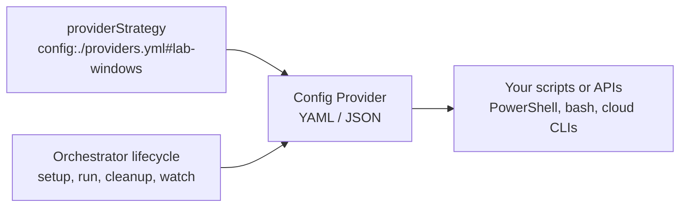

# Config-Defined Providers

Use a config-defined provider when you want to add an Orchestrator provider with only YAML or JSON.
This is the lightest extension path: no TypeScript package, no provider executable, and no custom
CLI protocol implementation.

Config-defined providers are useful when you already have scripts, internal CI commands, lab machine
dispatchers, cloud CLIs, or automation endpoints that can be called from the runner. Orchestrator
still owns the job lifecycle; your config file maps each lifecycle operation to shell commands.



## When to Use This

| Extension path          | Best fit                                                                 |
| ----------------------- | ------------------------------------------------------------------------ |
| Built-in provider type  | AWS, Kubernetes, local Docker, local system, GitHub dispatch, GitLab CI. |
| Config-defined provider | Wrap existing commands or APIs without writing provider code.            |
| CLI provider protocol   | Write a provider in any language with structured JSON stdin/stdout.      |
| TypeScript provider     | Build a full provider package with direct access to Orchestrator types.  |
| Engine plugin           | Add or override how a game engine command is detected and executed.      |

Use a config-defined provider first when shell commands are enough. Move to the
[CLI provider protocol](cli-provider-protocol) when the provider needs richer request parsing,
streaming control, polling, or robust error handling. Move to
[TypeScript custom providers](custom-providers) when the provider should share code with
Orchestrator internals.

## Quick Start

Create `.game-ci/providers/local-shell.yml`:

```yaml
name: local-shell
shell: bash
cwd: .
env:
  PROVIDER_NAME: local-shell
lifecycle:
  setup: |
    echo "$PROVIDER_NAME ready for $GAME_CI_BUILD_GUID"

  run-task: |
    mkdir -p "$GAME_CI_WORKING_DIR"
    cd "$GAME_CI_WORKING_DIR"
    printf '%s\n' "$GAME_CI_COMMANDS" > .game-ci-task.sh
    bash .game-ci-task.sh

  cleanup: |
    echo "$PROVIDER_NAME cleanup complete"
```

Use it as the provider strategy:

```yaml
- uses: game-ci/unity-builder@v4
  with:
    providerStrategy: config:./.game-ci/providers/local-shell.yml
    targetPlatform: StandaloneLinux64
```

The standalone Orchestrator CLI can use the same file:

```bash
game-ci orchestrate \
  --provider-strategy config:./.game-ci/providers/local-shell.yml \
  --target-platform StandaloneLinux64
```

## Multi-Provider Files

A single file can define multiple provider entries. Select one with `#providerName`.

```yaml
providers:
  lab-linux:
    shell: bash
    lifecycle:
      run-task: |
        ssh build-linux-01 "$GAME_CI_COMMANDS"

  lab-windows:
    shell: pwsh
    lifecycle:
      run-task: |
        Invoke-Command -ComputerName build-win-01 -ScriptBlock {
          param($Command)
          pwsh -NoLogo -Command $Command
        } -ArgumentList $env:GAME_CI_COMMANDS
```

```yaml
- uses: game-ci/unity-builder@v4
  with:
    providerStrategy: config:./.game-ci/providers.yml#lab-windows
    targetPlatform: StandaloneWindows64
```

## Lifecycle Commands

Define commands under `lifecycle` or `commands`. `run-task` is required. Other lifecycle commands
are optional.

| Lifecycle method | YAML aliases                                      | Purpose                                      |
| ---------------- | ------------------------------------------------- | -------------------------------------------- |
| Setup            | `setup`, `setup-workflow`, `setupWorkflow`        | Prepare infrastructure or verify access.     |
| Run task         | `run`, `run-task`, `runTask`, `runTaskInWorkflow` | Execute the build, test, or custom workload. |
| Cleanup          | `cleanup`, `cleanup-workflow`, `cleanupWorkflow`  | Tear down temporary resources.               |
| Garbage collect  | `garbage-collect`, `garbageCollect`               | Remove stale resources or caches.            |
| List resources   | `resources`, `list-resources`, `listResources`    | Return active resource names.                |
| List workflow    | `workflow`, `list-workflow`, `listWorkflow`       | Return active workflow names.                |
| Watch workflow   | `watch`, `watch-workflow`, `watchWorkflow`        | Stream or poll a running workflow.           |

Command entries can be strings:

```yaml
lifecycle:
  run-task: ./ci/run-provider-job.sh
```

Or objects with command-specific settings:

```yaml
shell: bash
cwd: .
lifecycle:
  run-task:
    command: ./ci/run-provider-job.sh
    cwd: ./ci
    shell: bash
    allowFailure: false
```

Provider-level `shell`, `cwd`, and `env` values are inherited by lifecycle commands unless a command
overrides them.

## Runtime Context

Orchestrator passes the lifecycle context through environment variables.

| Variable                        | Description                                           |
| ------------------------------- | ----------------------------------------------------- |
| `GAME_CI_BUILD_GUID`            | Unique workflow/build identifier.                     |
| `GAME_CI_BRANCH_NAME`           | Source branch name when available.                    |
| `GAME_CI_IMAGE`                 | Container image requested for the task.               |
| `GAME_CI_COMMANDS`              | Generated command script for the build, test, or job. |
| `GAME_CI_MOUNT_DIR`             | Mount directory expected by the provider.             |
| `GAME_CI_WORKING_DIR`           | Working directory inside the workload environment.    |
| `GAME_CI_BUILD_PARAMETERS_JSON` | Full Orchestrator build parameters as JSON.           |
| `GAME_CI_ENVIRONMENT_JSON`      | Environment variables requested for the task as JSON. |
| `GAME_CI_SECRETS_JSON`          | Secret definitions requested for the task as JSON.    |
| `GAME_CI_DEFAULT_SECRETS_JSON`  | Default secret mappings passed during setup/cleanup.  |
| `GAME_CI_FILTER`                | Garbage collection filter.                            |
| `GAME_CI_PREVIEW_ONLY`          | Whether garbage collection is a dry run.              |
| `GAME_CI_OLDER_THAN`            | Garbage collection age threshold.                     |
| `GAME_CI_FULL_CACHE`            | Whether full cache cleanup was requested.             |
| `GAME_CI_BASE_DEPENDENCIES`     | Whether base dependency cleanup was requested.        |

Task environment entries are also exposed by name. For example, an environment item named
`UNITY_LICENSE` becomes `$UNITY_LICENSE` or `$env:UNITY_LICENSE`.

Secrets are exposed by their configured `EnvironmentVariable` names.

## Template Placeholders

Commands and `cwd` can use simple `{{ path.to.value }}` placeholders:

```yaml
lifecycle:
  setup: |
    echo "Starting {{ buildGuid }} for {{ buildParameters.targetPlatform }}"
  run-task:
    cwd: '{{ buildParameters.projectPath }}'
    command: |
      echo "Using image {{ image }}"
      bash -lc "$GAME_CI_COMMANDS"
```

Environment variables are available under `env`:

```yaml
lifecycle:
  run-task: |
    echo "Provider {{ env.PROVIDER_NAME }} running {{ env.GAME_CI_BUILD_GUID }}"
```

## Listing Resources and Workflows

`list-resources` and `list-workflow` can return JSON arrays or newline-delimited names.

```yaml
lifecycle:
  list-resources: |
    printf '%s\n' '["worker-a", {"Name": "worker-b"}]'
```

```yaml
lifecycle:
  list-workflow: |
    printf '%s\n' active-build-1 active-build-2
```

## Godot and Unreal Examples

Config-defined providers are provider plugins, not engine plugins. They receive the generated engine
command in `GAME_CI_COMMANDS`, so the same provider can run Unity, Godot, Unreal, or a custom job if
the target machine or container has the required tools.

For a Godot export on a lab machine:

```yaml
name: lab-godot
shell: bash
lifecycle:
  run-task: |
    ssh godot-builder-01 "
      cd '$GAME_CI_WORKING_DIR' &&
      $GAME_CI_COMMANDS
    "
```

For an Unreal-capable machine:

```yaml
name: lab-unreal
shell: bash
lifecycle:
  run-task: |
    ssh unreal-builder-01 "
      export UE_ROOT=/opt/unreal-engine &&
      cd '$GAME_CI_WORKING_DIR' &&
      $GAME_CI_COMMANDS
    "
```

If you need to replace the generated engine command itself, use an
[engine plugin](../advanced-topics/engine-plugins) or a `customJob` instead.

## Failure Behavior

A lifecycle command fails when it exits with a non-zero status. Set `allowFailure: true` for
optional commands such as best-effort cleanup:

```yaml
lifecycle:
  cleanup:
    command: ./ci/cleanup-lab-machine.sh
    allowFailure: true
```

Keep config-defined providers small and explicit. If the file grows into a full program, move the
logic into a script, the CLI provider protocol, or a TypeScript provider and keep this file as the
thin lifecycle map.

## Related

- [Provider Types](overview) - choose an execution backend
- [CLI Provider Protocol](cli-provider-protocol) - write providers in any language
- [Custom Providers](custom-providers) - TypeScript and JavaScript provider modules
- [Engine Plugins](../advanced-topics/engine-plugins) - add or override engine behavior
