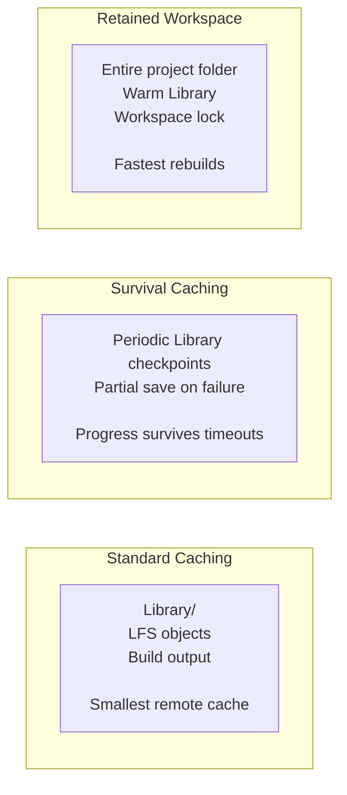
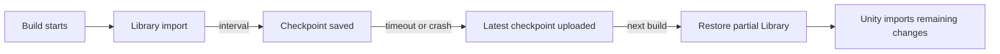
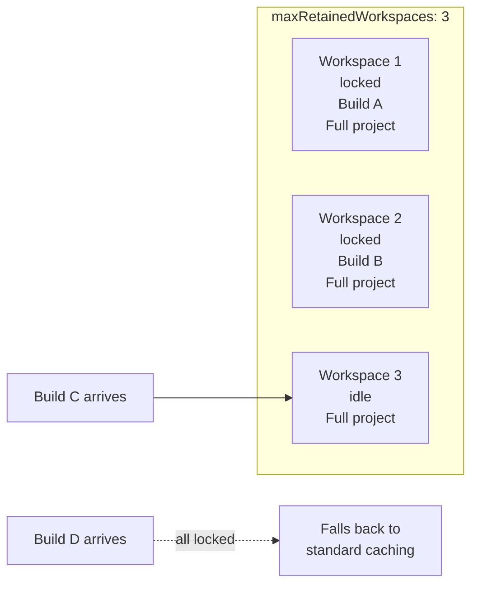

# Caching

Orchestrator caches Unity imports, Git LFS objects, build output, and retained workspaces so remote
builds do not start cold every time. Choose the smallest cache mode that solves the bottleneck:
standard Library/LFS caching for most projects, checkpointing for imports that may time out, and
retained workspaces for very large projects that need the full project folder to survive between
jobs.



## Standard Caching

Standard caching stores the engine's imported asset cache and Git LFS objects between builds. For
Unity this is the `Library` folder. For other engines, the cached folders are defined by the
[engine plugin](engine-plugins), such as `.godot/imported` for Godot. It uses less storage than a
retained workspace but still requires some import work after each restore.

- Minimum storage cost
- Best for smaller projects and ordinary PR builds
- Slower than retained workspaces for very large asset libraries

Unity Library restores are validated before being accepted. Empty Library folders and AssetDatabase
skeletons, such as zero-byte `Library/ArtifactDB` or `Library/assetDatabase.info` files, are treated
as cache misses. This prevents a broken or incomplete Library from being reused as if it were a warm
cache hit.

For local filesystem caches on persistent runners, see
[Local Build Caching](build-services#local-build-caching) for fallback keys and directory-based
cache modes.

## Build Caching

Orchestrator automatically caches build output alongside the Library cache. After each successful
build, the compiled output folder is archived and stored using the same cache key, which defaults to
the branch name. On the next build with the same cache key, the previous build output is available
at `/data/cache/{cacheKey}/build/`.

This happens automatically - no configuration required. The cache key controls which builds share
output:

```yaml
# Builds on the same branch share cached output (default behavior)
cacheKey: ${{ github.ref_name }}

# Or share across branches by using a fixed key
cacheKey: shared-cache
```

Build caching uses the same compression and storage provider as Library caching. Archives are stored
as `build-{buildGuid}.tar.lz4` (or `.tar` if compression is disabled). See [Storage](storage) for
details on compression and storage backends.

## Cache Checkpointing and Survival

Cache checkpointing is for projects where the first Library import can exceed the available build
time. Standard caching saves only after a successful post-build step. If a six-hour job is killed
after five hours of import work, the next build starts from zero unless an intermediate checkpoint
was saved.



Set `cacheCheckpointInterval` to save the Library folder periodically while Unity is running:

```yaml
- uses: game-ci/unity-builder@v4
  with:
    providerStrategy: aws
    targetPlatform: StandaloneLinux64
    cacheCheckpointInterval: 30
    containerMemory: 16384
```

The interval is in minutes. The checkpoint process keeps the latest checkpoints on disk and relies
on the configured cache upload hook to push them after the build container stops.

Use `cacheSaveOnFailure` for builds that may exit non-zero because of OOMs, crashes, or assertions:

```yaml
- uses: game-ci/unity-builder@v4
  with:
    providerStrategy: aws
    targetPlatform: StandaloneLinux64
    cacheCheckpointInterval: 30
    cacheSaveOnFailure: true
```

`cacheSaveOnFailure` installs an exit trap that writes a partial Library archive before the cache
upload step runs. It does not replace checkpointing for hard timeouts, because a SIGKILL may not
give the process a chance to run the trap.

| Scenario            | `cacheCheckpointInterval`   | `cacheSaveOnFailure`      |
| ------------------- | --------------------------- | ------------------------- |
| CI timeout          | Recommended                 | May not run after SIGKILL |
| OOM or editor crash | Useful                      | Recommended               |
| Normal warm builds  | Optional                    | No-op on success          |
| Very large Library  | Consider retained workspace | Useful fallback           |

For large Unity projects, start with a 30-minute interval. Increase it to 60 or 90 minutes when the
Library folder is tens of gigabytes and checkpoint archives consume too much I/O.

## Cache Retention

Use `cacheRetentionDays` to automatically remove old cache entries from storage:

```yaml
- uses: game-ci/unity-builder@v4
  with:
    providerStrategy: aws
    cacheRetentionDays: 30
```

| Setting       | Effect                                  |
| ------------- | --------------------------------------- |
| `0` (default) | Keep cache entries until manual cleanup |
| `7`           | Short-lived feature branch caches       |
| `30`          | Main and develop branch caches          |
| `90`          | Release branch caches                   |

You can vary retention by branch:

```yaml
cacheRetentionDays: ${{ github.ref == 'refs/heads/main' && '90' || '14' }}
```

## Retained Workspaces

Retained workspaces cache the **entire project folder** between builds. This is the fastest rebuild
mode because the checkout, engine import cache, package cache, and other workspace-local state can
survive from one job to the next.

Use retained workspaces when cache archive restore is still too expensive, or when one persistent
host builds several projects and should preserve warmed workspaces safely between jobs.



Set `maxRetainedWorkspaces` to control how many full workspaces are kept:

| Value | Behavior                                                                  |
| ----- | ------------------------------------------------------------------------- |
| `0`   | Unlimited retained workspaces.                                            |
| `> 0` | Keep at most N workspaces. Additional jobs fall back to standard caching. |

```yaml
- uses: game-ci/unity-builder@v4
  with:
    providerStrategy: aws
    maxRetainedWorkspaces: 3
    targetPlatform: StandaloneLinux64
    gitPrivateToken: ${{ secrets.GITHUB_TOKEN }}
```

Each retained workspace is locked during use. Orchestrator handles locking through the configured
storage provider, so concurrent builds do not write into the same workspace at the same time.

Retained workspaces trade storage for speed. A 20 GB project with three retained workspaces can use
roughly 60 GB before cache archives, build output, and provider overhead are counted.

## Storage Providers

| Provider | `storageProvider` | Description                                                                                                                      |
| -------- | ----------------- | -------------------------------------------------------------------------------------------------------------------------------- |
| S3       | `s3` (default)    | AWS S3 storage. Works with both AWS and LocalStack.                                                                              |
| Rclone   | `rclone`          | Flexible cloud storage via [rclone](https://rclone.org). Supports 70+ backends (Google Cloud, Azure Blob, Backblaze, SFTP, etc). |

Configure with the [`storageProvider`](../api-reference#storage) parameter. When using rclone, also
set `rcloneRemote` to your configured remote endpoint.

## Workspace Locking

When using retained workspaces, Orchestrator uses distributed locking (via S3 or rclone) to ensure
only one build uses a workspace at a time. This enables safe concurrent builds that share and reuse
workspaces without conflicts.

Locking is managed automatically - no configuration required beyond setting `maxRetainedWorkspaces`.

## Pre-Warming the Cache

For projects where the first import still takes too long, pre-warm the cache by uploading a Library
folder from a trusted local or self-hosted build.

```bash
cd /path/to/unity-project
tar -cf library-warm.tar Library

aws s3 cp library-warm.tar \
  s3://<your-awsStackName>/orchestrator-cache/<your-cacheKey>/Library/library-warm.tar
```

Where `<your-cacheKey>` is either the branch name or the `cacheKey` input value. You can also run
one full build on a self-hosted runner or EC2 instance without CI time limits, then let subsequent
GitHub Actions builds restore the warm cache.

## Combining with Unity Accelerator

Checkpointing and [Unity Accelerator](unity-accelerator) solve different parts of the same problem:

- Checkpointing saves the Library folder state periodically.
- Accelerator caches individual asset import results.

Use both when interrupted imports are common and import results need to survive independently from a
single Library archive:

```yaml
- uses: game-ci/unity-builder@v4
  env:
    UNITY_ACCELERATOR_ENDPOINT: '127.0.0.1:10080'
  with:
    providerStrategy: aws
    containerHookFiles: accelerator-start,aws-s3-upload-build,aws-s3-upload-cache,accelerator-upload
    cacheCheckpointInterval: 30
    cacheSaveOnFailure: true
    cacheRetentionDays: 30
    containerMemory: 16384
```

## Troubleshooting

### Checkpoints are not being saved

- Verify `cacheCheckpointInterval` is greater than `0`.
- Check container logs for cache checkpoint messages.
- Confirm Unity has created a `Library` folder before the first interval elapses.
- Check disk space; checkpoint archives are skipped when the volume is full.

### Partial cache does not restore

- Confirm the upload hook runs after the build task stops.
- Verify the storage backend contains checkpoint files under the cache key's `Library/` path.
- For hard timeouts, reduce the checkpoint interval so at least one checkpoint exists before the
  kill signal.

### Cache storage keeps growing

- Set `cacheRetentionDays`.
- Use `useCompressionStrategy: true` for LZ4 archives.
- Use branch-specific `cacheKey` values so feature branch caches do not overwrite or inflate main
  branch caches.

## Self-Hosted Cache Integrity

When using retained workspaces or local filesystem caches on persistent runners, additional
integrity checks prevent subtle cache corruption that ephemeral runners never encounter.

### DAG File Repair

Unity's Bee build system stores incremental compilation state as DAG files in `Library/Bee/`. These
files contain absolute workspace paths. When a Library cache is restored from a different runner (or
from a shared cache directory), the paths no longer match the current workspace.

Repair DAG files after cross-runner restore by replacing the old workspace path with the current
one. Without this, Bee either rebuilds everything from scratch (negating the cache) or produces
incorrect incremental builds. See
[Self-Hosting and Orchestrator](self-hosting-and-orchestrator#dag-file-repair) for implementation
details.

### LFS Pointer Poisoning

Git LFS pointer files that were not hydrated can end up in the workspace as small text files (under
200 bytes, starting with `version https://git-lfs.`). Unity treats these as valid binaries, causing
`BadImageFormatException` or `TypeLoadException` during domain reload.

Scan for unhydrated LFS pointers before Unity launches — not after a build failure. Any `.dll`,
`.so`, or `.dylib` file under 200 bytes with an LFS header is a pointer that needs hydration. See
[Self-Hosting and Orchestrator](self-hosting-and-orchestrator#lfs-pointer-poisoning) for detection
scripts.

### Profile Fingerprinting

Monorepos that switch between build profiles on the same runner must invalidate compilation caches
when the profile changes. Generate a fingerprint from the profile's submodule set and scripting
defines. When the fingerprint changes, clear `Library/ScriptAssemblies` and `Library/Bee` but
preserve asset imports (textures, meshes, shader cache), which are profile-independent.

See [Self-Hosting and Orchestrator](self-hosting-and-orchestrator#profile-switching) for the
fingerprinting pattern.

## Canonical Cache + Overlay (Advanced)

For studios running multiple self-hosted runners on the same physical host with multi-GB Library
folders, the existing `localCacheMode` values trade off in known ways:

- `tar` — pays archive + extract on every restore.
- `move-directory` — instant atomic same-volume rename, but **consume-once**: only one runner
  takes the cache; the next runner cold-starts.
- `copy-directory` — multi-runner-safe, but pays full byte-copy cost on every restore. For a
  30 GB Library folder this is minutes per build.

The opt-in `canonical-overlay` mode combines the multi-runner safety of `copy-directory` with the
zero-copy speed of `move-directory`. The pattern is well-known from VFSForGit, Scalar, the Nix
store, and Bazel CAS: write the cache **once** to a content-addressed canonical store, and per-
runner overlays consume it via OS-native hardlinks (NTFS on Windows, ext4/xfs/btrfs/zfs on Linux).

### When to use it

- Multiple self-hosted runners share the same physical host and filesystem.
- Library folder is multi-GB; per-restore copy or extract is unacceptably slow.
- Cancel-in-progress is foundational (CI cancels mid-flight pushes regularly), so the cache must
  survive SIGKILL of the publishing job without corruption.

### Architecture

```
<canonicalRoot>/<cacheKey>/
    Library/
        <sha-A>/             # canonical version A (hardlinked into runner overlays)
        <sha-B>/             # canonical version B (current)
        latest -> <sha-B>    # directory junction / symlink

<runner workspace>/Library/
    <files>                  # hardlinks pointing at canonical bytes
```

The canonical store is written **atomically** by `Publish-Canonical`:

1. Walk the runner's freshly-built Library; hardlink files into `<sha-B>-staging/`.
2. Write `.cache_complete` marker into the staging directory.
3. Atomic rename `<sha-B>-staging/` → `<sha-B>/`. This is the publish moment.
4. Atomic update of the `latest` pointer.

If PostUnityJob is cancelled mid-publish (SIGKILL during the staging walk), the rename never
happens. The orphan staging directory is harmless and gets cleaned up by the next build. The
existing canonical version and `latest` pointer are intact.

When PreUnityJob runs on any runner, `Materialize-Overlay` reads the `latest` pointer and creates
hardlinks from canonical into a per-runner overlay directory. Hardlink creation is one syscall per
file (~0.1 ms on Windows). For a Library with 200,000 files, materialization is ~20 s — orders of
magnitude faster than copying multi-GB content.

### Hardlink safety contract

Not every Library subdirectory is safe to hardlink. The invariant: hardlink is safe only if the
writer uses **write-temp-then-rename**, not in-place modification. In-place modification would
write through the hardlink to canonical bytes, corrupting the canonical store for every consumer.

The default classifier targets Unity's Library structure:

| Subdirectory                                                                                                                                                     | Strategy           | Why                                                                       |
| ---------------------------------------------------------------------------------------------------------------------------------------------------------------- | ------------------ | ------------------------------------------------------------------------- |
| `PackageCache/<package>@<hash>/`                                                                                                                                 | Directory junction | Unity treats packages as immutable; new version = new `@<hash>` directory |
| `ScriptAssemblies/`, `Artifacts/`, `BurstCache/`, `Bee/artifacts/`, `MetadataGenerator/`, `ShaderCache/`, `StateCache/`, `UIBuilder/`, `HDRPLibrary/`            | Hardlink           | Roslyn, Bee, AssetDatabase v2 all use write-temp-then-rename              |
| `PackageManager/projectResolution.json`, `PackageManager/ProjectCache`, `Bee/*.dag`, `Bee/*.dag.outputdata`, `Bee/*-inputdata.json`, `LastSceneManagerSetup.txt` | Per-runner copy    | Contain absolute workspace paths; need cross-runner repair                |
| `AnnotationManager`, `EditorOnly`, `EditorUserBuildSettings.asset`, `EditorUserSettings.asset`, `CurrentLayout-*.dwlt`                                           | Skip               | Editor session state; not part of the build cache                         |
| (default)                                                                                                                                                        | Hardlink           | Conservative default for unknown subtrees                                 |

For non-Unity engines, override the classifier with `canonicalCacheClassifier`:

```yaml
- uses: game-ci/unity-builder@v4
  with:
    localCacheMode: canonical-overlay
    canonicalCacheClassifier: |
      {
        "default": "hardlink",
        "rules": [
          { "pattern": "imported/**", "strategy": "junction" },
          { "pattern": "session/**", "strategy": "skip" }
        ]
      }
```

### Configuration

```yaml
- uses: game-ci/unity-builder@v4
  with:
    localCacheEnabled: true
    localCacheMode: canonical-overlay
    canonicalCacheRoot: D:/CI/Canonical # falls back to <localCacheRoot>/canonical
    canonicalCacheVersionRetention: 2 # keep last 2 SHA versions per key
    cacheMaterialize: prepared # sub-second hydration
    cacheSentinelCanary: true # defense-in-depth
```

### Sub-second hydration with `prepared` materialize

Eager materialize (the default for `canonical-overlay`) creates the overlay during PreUnityJob,
on the build's critical path. For a 200k-file Library this is ~20 s.

`cacheMaterialize: prepared` shifts the overlay creation off the critical path entirely. After a
successful build:

1. PostUnityJob publishes the canonical version.
2. PostUnityJob then hardlink-clones the canonical into `<overlay>-prepared/`.
3. The next PreUnityJob detects the prepared overlay, atomic-renames it into place, and starts
   the build immediately.

Sub-second hydration in the steady state. If the prepared overlay's SHA doesn't match the current
canonical's `latest` SHA (a different runner published a newer version in between), it falls
through to live materialize.

### Failure modes and self-heal

| Scenario                                    | Behaviour                                                                                                 |
| ------------------------------------------- | --------------------------------------------------------------------------------------------------------- |
| Cancel during canonical publish             | Orphan `<sha>-staging/` directory; existing canonical version intact. Next build cleans up.               |
| Cancel during prepared overlay build        | Orphan `<overlay>-prepared/` directory; harmless. Next build falls through to live materialize.           |
| Overlay missing or corrupt                  | `materializeOverlay` rebuilds deterministically from canonical. Idempotent.                               |
| Canonical missing (host loss, disk failure) | Next successful build re-establishes canonical via `publishCanonical`. One cold path back to clean state. |
| Sentinel canary mismatch (when enabled)     | Overlay is discarded; falls through to live materialize.                                                  |

### Cross-platform behaviour

The strategy degrades gracefully when filesystems don't support hardlinks. Build never fails
because of strategy unavailability.

| OS / Filesystem             | Behaviour                                                                                       |
| --------------------------- | ----------------------------------------------------------------------------------------------- |
| Windows NTFS                | Full implementation — hardlinks for files, directory junctions for read-only subtrees           |
| Windows ReFS                | Hardlinks work; reflinks (per-file COW) documented as future stretch                            |
| Linux ext4 / xfs            | Hardlinks work; junctions emulated via symlinks or per-runner copy                              |
| Linux btrfs / zfs           | Hardlinks work; reflinks (block-level COW) documented as future stretch                         |
| macOS APFS                  | Hardlinks work; clonefile reflinks documented as future stretch                                 |
| Containerised runs (Docker) | Falls back to `move-directory` — canonical store doesn't make sense across container boundaries |
| Cross-volume runners        | Falls back to `move-directory` — hardlinks can't cross drive letters / mount points             |

When falling back, a structured warning is emitted via `OrchestratorLogger`.

### Limitations

1. **Single-host topology only.** All runners must share one filesystem. Multi-host CI farms need
   different infrastructure (S3/MinIO via the existing `storageProvider` rclone path, or planned
   future strategies — see "Future strategies" below).
2. **NTFS, ext4, xfs needed for full benefit.** ReFS, btrfs, zfs, APFS work via hardlinks but
   reflink-aware variants (per-file copy-on-write — strictly better) are documented as future
   stretch options.
3. **`Remove-Item -Recurse` on junctions has historically been unsafe in some PowerShell
   versions.** The implementation uses `cmd /c rmdir /s /q` for junction-safe directory removal
   on Windows.
4. **1023 hardlinks per inode on NTFS.** Not a practical constraint at typical fleet sizes;
   `canonicalCacheVersionRetention: 2` (default) limits inode-link count.
5. **Modify-in-place writes propagate to canonical bytes.** Mitigated by the classifier audit
   above. Unknown subtrees default to hardlink (conservative for read-mostly use); the
   `cacheSentinelCanary` flag provides defense-in-depth.
6. **Tested at scale on Windows NTFS in a 10-runner farm.** The Linux hardlink path lands with
   platform-gated tests but has not been validated at multi-GB scale yet.

### Performance characteristics

| Configuration                                             | Materialize time on critical path           |
| --------------------------------------------------------- | ------------------------------------------- |
| `tar`                                                     | Minutes for multi-GB archive + extract      |
| `copy-directory`                                          | Minutes for multi-GB byte copy              |
| `move-directory`                                          | Sub-second, but consume-once across runners |
| `canonical-overlay`, eager materialize                    | 15-30 s for ~200k files (hardlinks only)    |
| `canonical-overlay`, eager + PackageCache junctions       | 2-8 s                                       |
| `canonical-overlay`, prepared overlay (steady state)      | < 1 s (atomic rename)                       |
| `canonical-overlay`, prepared overlay (canonical changed) | 2-8 s (live materialize fallback)           |

### Future strategies in this taxonomy

The `localCacheMode` value space is extensible. Future strategies expected to follow the same
shape (none implemented yet — RFC welcome):

- **`reflink-overlay`** — block-level copy-on-write via Linux btrfs/xfs/zfs reflinks, macOS
  APFS clonefile, or Windows ReFS. Equivalent to `canonical-overlay` but per-file COW (no
  modify-in-place footgun).
- **`bind-mount`** — read-only bind mount of canonical with overlayfs (Linux) or junction-based
  Windows variants for filesystems that don't support fine-grained hardlinks.
- **`nfs-passthrough`** — single-source-of-truth pattern; treat a network mount as canonical and
  skip the publish step entirely. Trades network read latency for zero local disk usage.

## Self-Hosted Operational Lessons

The following operational lessons apply when running orchestrator on long-lived self-hosted
runners. They surface symptoms that ephemeral runners never encounter.

### PackageCache subtree corruption from cross-runner restore

When `Library/PackageCache/<package>@<hash>/` is partially populated (an interrupted copy or
extract), the directory may contain `.meta` files with no associated content files. Unity treats
this as a hard error and aborts the import.

Detect orphan-meta directories before Unity launches. Quarantine the affected package
directories and let Unity re-extract them from the package's source on the next import.

### PowerShell forward-reference bug masking real test failures

In PowerShell scripts orchestrating Unity (a common pattern for `remote-powershell` provider
jobs), calling a function before its definition silently fails in non-strict mode. The
downstream error surfaces as the failure, hiding the real cause.

Either set `Set-StrictMode -Version Latest` at the top of build scripts, or order helper
function definitions before any code that calls them. This is especially important when scripts
grow over time and developers add new top-level orchestration that calls helpers defined later
in the same file.

### GitHub Actions runner `_runner_file_commands` race

When multiple steps in the same job emit `core.setOutput` concurrently (fan-out steps merging
results back into the runner-level outputs file), they race on the shared
`_runner_file_commands` runner-temp file. Symptom: outputs appear empty or corrupted, with no
clear error.

Serialise output-emitting steps. If a job needs to emit several outputs from parallel
sub-jobs, collect them into a single output-emitting step at the end.

### Path-filter on the workflow entrypoint to skip docs-only commits

Docs-only pushes (markdown changes, README updates) shouldn't trigger Unity CI runs. A
`paths-ignore` block on the workflow entrypoint prevents the orchestrator pipeline from
spending build minutes on commits that can't change build output:

```yaml
on:
  push:
    branches: [main]
    paths-ignore:
      - 'docs/**'
      - '*.md'
      - '*.txt'
```

This is a workflow-level concern, not an orchestrator setting, but it pairs naturally with the
caching strategies above — fewer wasted builds means less cache churn.

## Inputs Reference

| Input                            | Description                                                                                                         |
| -------------------------------- | ------------------------------------------------------------------------------------------------------------------- |
| `cacheKey`                       | Override the cache key used for cache isolation                                                                     |
| `cacheCheckpointInterval`        | Minutes between Library checkpoints; `0` disables                                                                   |
| `cacheSaveOnFailure`             | Save a partial cache after non-zero build exit                                                                      |
| `cacheRetentionDays`             | Remove cache entries older than N days                                                                              |
| `maxRetainedWorkspaces`          | Number of retained full workspaces to keep                                                                          |
| `maxCacheEntries`                | Max tar snapshots to retain per cache folder (default: 2)                                                           |
| `minCacheEntries`                | Minimum cache entries to keep during age-based GC (floor)                                                           |
| `skipCache`                      | Skip cache restore entirely                                                                                         |
| `useCompressionStrategy`         | Use LZ4 compression for cache archives                                                                              |
| `localCacheMode`                 | One of `tar`, `move-directory`, `copy-directory`, `canonical-overlay`                                               |
| `canonicalCacheRoot`             | Path for the canonical store (when `localCacheMode: canonical-overlay`); falls back to `<localCacheRoot>/canonical` |
| `canonicalCacheClassifier`       | JSON describing per-subdirectory hardlink/junction/copy/skip strategy; defaults target Unity Library                |
| `canonicalCacheVersionRetention` | How many canonical SHA versions to keep per cache key (default: 2)                                                  |
| `cacheMaterialize`               | `eager` (live materialize) or `prepared` (atomic-rename a pre-built overlay for sub-second hydration)               |
| `cacheSentinelCanary`            | Defense-in-depth corruption check; writes a known-content file into the overlay and verifies on consume             |
