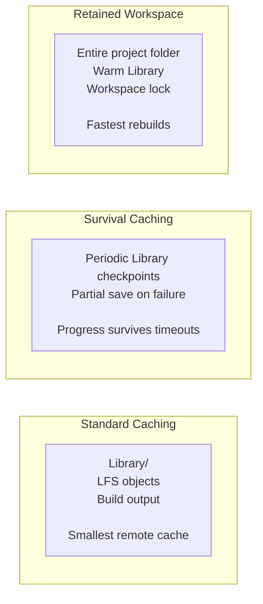
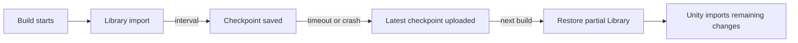

# Caching

Orchestrator caches Unity imports, Git LFS objects, build output, and retained workspaces so remote
builds do not start cold every time. Choose the smallest cache mode that solves the bottleneck:
standard Library/LFS caching for most projects, checkpointing for imports that may time out, and
retained workspaces for very large projects that need the full project folder to survive between
jobs.



## Standard Caching

Standard caching stores the engine's imported asset cache and Git LFS objects between builds. For
Unity this is the `Library` folder. For other engines, the cached folders are defined by the
[engine plugin](engine-plugins), such as `.godot/imported` for Godot. It uses less storage than a
retained workspace but still requires some import work after each restore.

- Minimum storage cost
- Best for smaller projects and ordinary PR builds
- Slower than retained workspaces for very large asset libraries

Unity Library restores are validated before being accepted. Empty Library folders and AssetDatabase
skeletons, such as zero-byte `Library/ArtifactDB` or `Library/assetDatabase.info` files, are treated
as cache misses. This prevents a broken or incomplete Library from being reused as if it were a warm
cache hit.

For local filesystem caches on persistent runners, see
[Local Build Caching](build-services#local-build-caching) for fallback keys and directory-based
cache modes.

Unity Library restores are validated before being accepted. Empty Library folders and AssetDatabase
skeletons, such as zero-byte `Library/ArtifactDB` or `Library/assetDatabase.info` files, are treated
as cache misses. This prevents a broken or incomplete Library from being reused as if it were a warm
cache hit.

For local filesystem caches on persistent runners, see
[Local Build Caching](build-services#local-build-caching) for fallback keys and directory-based
cache modes.

## Build Caching

Orchestrator automatically caches build output alongside the Library cache. After each successful
build, the compiled output folder is archived and stored using the same cache key, which defaults to
the branch name. On the next build with the same cache key, the previous build output is available
at `/data/cache/{cacheKey}/build/`.

This happens automatically - no configuration required. The cache key controls which builds share
output:

```yaml
# Builds on the same branch share cached output (default behavior)
cacheKey: ${{ github.ref_name }}

# Or share across branches by using a fixed key
cacheKey: shared-cache
```

Build caching uses the same compression and storage provider as Library caching. Archives are stored
as `build-{buildGuid}.tar.lz4` (or `.tar` if compression is disabled). See [Storage](storage) for
details on compression and storage backends.

## Cache Checkpointing and Survival

Cache checkpointing is for projects where the first Library import can exceed the available build
time. Standard caching saves only after a successful post-build step. If a six-hour job is killed
after five hours of import work, the next build starts from zero unless an intermediate checkpoint
was saved.



Set `cacheCheckpointInterval` to save the Library folder periodically while Unity is running:

```yaml
- uses: game-ci/unity-builder@v4
  with:
    providerStrategy: aws
    targetPlatform: StandaloneLinux64
    cacheCheckpointInterval: 30
    containerMemory: 16384
```

The interval is in minutes. The checkpoint process keeps the latest checkpoints on disk and relies
on the configured cache upload hook to push them after the build container stops.

Use `cacheSaveOnFailure` for builds that may exit non-zero because of OOMs, crashes, or assertions:

```yaml
- uses: game-ci/unity-builder@v4
  with:
    providerStrategy: aws
    targetPlatform: StandaloneLinux64
    cacheCheckpointInterval: 30
    cacheSaveOnFailure: true
```

`cacheSaveOnFailure` installs an exit trap that writes a partial Library archive before the cache
upload step runs. It does not replace checkpointing for hard timeouts, because a SIGKILL may not
give the process a chance to run the trap.

| Scenario            | `cacheCheckpointInterval`   | `cacheSaveOnFailure`      |
| ------------------- | --------------------------- | ------------------------- |
| CI timeout          | Recommended                 | May not run after SIGKILL |
| OOM or editor crash | Useful                      | Recommended               |
| Normal warm builds  | Optional                    | No-op on success          |
| Very large Library  | Consider retained workspace | Useful fallback           |

For large Unity projects, start with a 30-minute interval. Increase it to 60 or 90 minutes when the
Library folder is tens of gigabytes and checkpoint archives consume too much I/O.

## Cache Retention

Use `cacheRetentionDays` to automatically remove old cache entries from storage:

```yaml
- uses: game-ci/unity-builder@v4
  with:
    providerStrategy: aws
    cacheRetentionDays: 30
```

| Setting       | Effect                                  |
| ------------- | --------------------------------------- |
| `0` (default) | Keep cache entries until manual cleanup |
| `7`           | Short-lived feature branch caches       |
| `30`          | Main and develop branch caches          |
| `90`          | Release branch caches                   |

You can vary retention by branch:

```yaml
cacheRetentionDays: ${{ github.ref == 'refs/heads/main' && '90' || '14' }}
```

## Retained Workspace

Caches the **entire project folder** between builds. Provides the fastest rebuilds but consumes more
storage.

- Maximum build speed
- Best for large projects with long import times
- Higher storage cost

See [Retained Workspaces](retained-workspace) for configuration details.

## Storage Providers

| Provider | `storageProvider` | Description                                                                                                                      |
| -------- | ----------------- | -------------------------------------------------------------------------------------------------------------------------------- |
| S3       | `s3` (default)    | AWS S3 storage. Works with both AWS and LocalStack.                                                                              |
| Rclone   | `rclone`          | Flexible cloud storage via [rclone](https://rclone.org). Supports 70+ backends (Google Cloud, Azure Blob, Backblaze, SFTP, etc). |

Configure with the [`storageProvider`](../api-reference#storage) parameter. When using rclone, also
set `rcloneRemote` to your configured remote endpoint.

## Workspace Locking

When using retained workspaces, Orchestrator uses distributed locking (via S3 or rclone) to ensure
only one build uses a workspace at a time. This enables safe concurrent builds that share and reuse
workspaces without conflicts.

Locking is managed automatically - no configuration required beyond setting `maxRetainedWorkspaces`.

## Pre-Warming the Cache

For projects where the first import still takes too long, pre-warm the cache by uploading a Library
folder from a trusted local or self-hosted build.

```bash
cd /path/to/unity-project
tar -cf library-warm.tar Library

aws s3 cp library-warm.tar \
  s3://<your-awsStackName>/orchestrator-cache/<your-cacheKey>/Library/library-warm.tar
```

Where `<your-cacheKey>` is either the branch name or the `cacheKey` input value. You can also run
one full build on a self-hosted runner or EC2 instance without CI time limits, then let subsequent
GitHub Actions builds restore the warm cache.

## Combining with Unity Accelerator

Checkpointing and [Unity Accelerator](unity-accelerator) solve different parts of the same problem:

- Checkpointing saves the Library folder state periodically.
- Accelerator caches individual asset import results.

Use both when interrupted imports are common and import results need to survive independently from a
single Library archive:

```yaml
- uses: game-ci/unity-builder@v4
  env:
    UNITY_ACCELERATOR_ENDPOINT: '127.0.0.1:10080'
  with:
    providerStrategy: aws
    containerHookFiles: accelerator-start,aws-s3-upload-build,aws-s3-upload-cache,accelerator-upload
    cacheCheckpointInterval: 30
    cacheSaveOnFailure: true
    cacheRetentionDays: 30
    containerMemory: 16384
```

## Troubleshooting

### Checkpoints are not being saved

- Verify `cacheCheckpointInterval` is greater than `0`.
- Check container logs for cache checkpoint messages.
- Confirm Unity has created a `Library` folder before the first interval elapses.
- Check disk space; checkpoint archives are skipped when the volume is full.

### Partial cache does not restore

- Confirm the upload hook runs after the build task stops.
- Verify the storage backend contains checkpoint files under the cache key's `Library/` path.
- For hard timeouts, reduce the checkpoint interval so at least one checkpoint exists before the
  kill signal.

### Cache storage keeps growing

- Set `cacheRetentionDays`.
- Use `useCompressionStrategy: true` for LZ4 archives.
- Use branch-specific `cacheKey` values so feature branch caches do not overwrite or inflate main
  branch caches.

## Inputs Reference

| Input                     | Description                                       |
| ------------------------- | ------------------------------------------------- |
| `cacheKey`                | Override the cache key used for cache isolation   |
| `cacheCheckpointInterval` | Minutes between Library checkpoints; `0` disables |
| `cacheSaveOnFailure`      | Save a partial cache after non-zero build exit    |
| `cacheRetentionDays`      | Remove cache entries older than N days            |
| `maxRetainedWorkspaces`   | Number of retained full workspaces to keep        |
| `skipCache`               | Skip cache restore entirely                       |
| `useCompressionStrategy`  | Use LZ4 compression for cache archives            |
