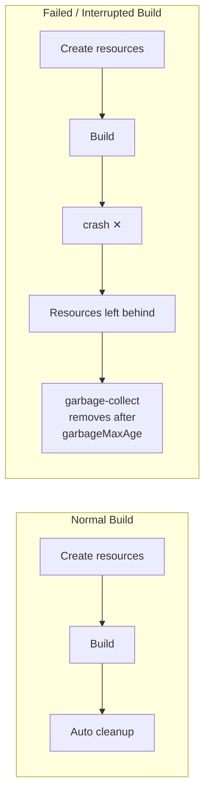

# Garbage Collection

Orchestrator creates cloud resources (containers, stacks, volumes) for each build and cleans them up
automatically. If a build fails or is interrupted, resources may be left behind.



Use garbage collection to clean up stale resources. See the
[API Reference](../api-reference#garbage-collection) for all parameters.

## Usage

### GitHub Actions

```yaml
- uses: game-ci/unity-builder@v4
  with:
    providerStrategy: aws
    mode: garbage-collect
    gitPrivateToken: ${{ secrets.GITHUB_TOKEN }}
```

### Command Line

```bash
yarn run cli -m garbage-collect --providerStrategy aws
```

## Parameters

| Parameter       | Default | Description                                           |
| --------------- | ------- | ----------------------------------------------------- |
| `garbageMaxAge` | `24`    | Maximum age in hours before resources are cleaned up. |

## 🔄 Automatic Cleanup

When using the AWS provider, Orchestrator can create a CloudFormation-based cleanup cron job that
automatically removes old ECS task definitions and resources. This is controlled by the
`useCleanupCron` parameter (enabled by default).
