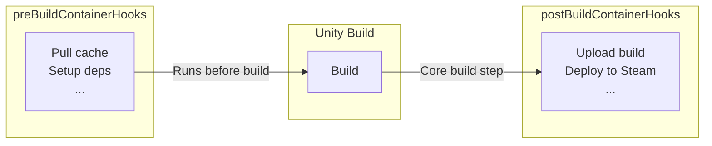

# Container Hooks

Run custom Docker containers as steps in the build workflow. Useful for uploading artifacts,
deploying builds, or running additional tools. For inline shell commands instead, see
[Command Hooks](command-hooks).



## Format

```yaml
- name: upload
  image: amazon/aws-cli
  commands: |
    echo "hello world!"
```

## Usage

Define container hooks inline via `preBuildContainerHooks` / `postBuildContainerHooks`, or reference
files from `.game-ci/container-hooks/` via `containerHookFiles`.

```yaml
- uses: game-ci/unity-builder@v4
  with:
    providerStrategy: aws
    containerHookFiles: aws-s3-upload-build
    targetPlatform: StandaloneLinux64
    gitPrivateToken: ${{ secrets.GITHUB_TOKEN }}
```

## Built-In Hooks

Orchestrator ships with ready-to-use hooks for S3, rclone, and Steam. See
[Built-In Hooks](built-in-hooks) for the full list.
