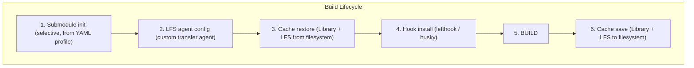

# Build Services

Build services run during the build lifecycle to handle submodule initialization, caching, LFS
configuration, and git hooks. They work with any provider - local, AWS, Kubernetes, GCP Cloud Run,
Azure ACI, or custom CLI providers.



## Submodule Profiles

Selectively initialize submodules from a YAML profile instead of cloning everything. Useful for
monorepos where builds only need a subset of submodules.

### Profile Format

```yaml
primary_submodule: MyGameFramework
submodules:
  - name: CoreFramework
    branch: main # initialize this submodule
  - name: OptionalModule
    branch: empty # skip this submodule (empty branch)
  - name: Plugins* # glob pattern  -  matches PluginsCore, PluginsAudio, etc.
    branch: main
```

- `branch: main` - initialize the submodule on its configured branch
- `branch: empty` - skip the submodule (checked out to an empty branch)
- Trailing `*` enables glob matching against submodule names

### Variant Overlays

A variant file merges on top of the base profile for build-type or platform-specific overrides:

```yaml
# server-variant.yml
submodules:
  - name: ClientOnlyAssets
    branch: empty # skip client assets for server builds
  - name: ServerTools
    branch: main # add server-only tools
```

### Inputs

| Input                  | Default | Description                             |
| ---------------------- | ------- | --------------------------------------- |
| `submoduleProfilePath` | -       | Path to YAML submodule profile          |
| `submoduleVariantPath` | -       | Path to variant overlay (merged on top) |
| `submoduleToken`       | -       | Auth token for private submodule clones |

### How It Works

1. Parses the profile YAML and optional variant overlay
2. Reads `.gitmodules` to discover all submodules
3. Matches each submodule against profile entries (exact name or glob)
4. Initializes matched submodules; skips the rest
5. If `submoduleToken` is set, configures git URL rewriting for auth

### Example

```yaml
- uses: game-ci/unity-builder@v4
  with:
    providerStrategy: local
    submoduleProfilePath: config/submodule-profiles/game/client/profile.yml
    submoduleVariantPath: config/submodule-profiles/game/client/server.yml
    submoduleToken: ${{ secrets.SUBMODULE_TOKEN }}
    targetPlatform: StandaloneLinux64
```

---

## Local Build Caching

Cache the Unity Library folder and LFS objects between local builds without external cache actions.
Filesystem-based - works on self-hosted runners with persistent storage.

### How It Works

- **Cache key**: `{platform}-{version}-{branch}` (sanitized)
- **Cache root**: `localCacheRoot` > `$RUNNER_TEMP/game-ci-cache` > `.game-ci/cache`
- **Restore**: restores the Library and LFS folders from the selected local cache mode
- **Save**: saves the Library and LFS folders after the build
- **Garbage collection**: removes cache entries that haven't been accessed recently

Unity Library restores are validated before being accepted. Empty Library folders and AssetDatabase
skeletons, such as zero-byte `Library/ArtifactDB` or `Library/assetDatabase.info` files, are treated
as cache misses.

### Fallback Keys

When `localCacheFallback` is enabled, the exact cache key is still tried first. If it misses, the
orchestrator searches for compatible local cache keys in this order:

1. Same platform and Unity version
2. Same platform
3. Same Unity version

This is useful for branch builds where a Library from `main` or `develop` is a better starting point
than a cold import. When a fallback Library is restored, Unity compilation artifacts that are
profile-dependent are cleared before the build:

- `Library/ScriptAssemblies`
- `Library/Bee`

You can also provide explicit fallback keys with `localCacheFallbackKeys`.

```yaml
- uses: game-ci/unity-builder@v4
  with:
    providerStrategy: local
    localCacheEnabled: true
    localCacheFallback: true
    localCacheFallbackKeys: StandaloneWindows64-2022_3_20f1-main,StandaloneWindows64-2022_3_20f1-develop
```

### Cache Mode

`localCacheMode` controls how the local cache stores and restores the Unity Library:

| Mode             | Behavior                 | Best for                                                      |
| ---------------- | ------------------------ | ------------------------------------------------------------- |
| `tar`            | Portable tar archive     | Default; works across platforms and filesystems               |
| `copy-directory` | Recursive directory copy | Shared seed caches that must remain available to other builds |
| `move-directory` | Directory move / rename  | Same-volume Windows self-hosted runners with large Libraries  |

`move-directory` can be much faster than tar extraction for very large Libraries because NTFS can
rename a directory on the same volume without copying file contents. Use it only when the cache root
and workspace are on the same volume and the workflow saves the Library back after the build. If
`localCacheFallback` restores a fallback key while `localCacheMode` is `move-directory`, the
fallback is copied instead of moved so the shared fallback seed remains available to other branches.

### Inputs

| Input                    | Default | Description                                              |
| ------------------------ | ------- | -------------------------------------------------------- |
| `localCacheEnabled`      | `false` | Enable filesystem caching                                |
| `localCacheRoot`         | -       | Cache directory override                                 |
| `localCacheLibrary`      | `true`  | Cache Unity Library folder                               |
| `localCacheLfs`          | `true`  | Cache LFS objects                                        |
| `localCacheFallback`     | `false` | Try compatible local cache keys after exact-key miss     |
| `localCacheFallbackKeys` | -       | Comma-separated explicit fallback keys                   |
| `localCacheMode`         | `tar`   | Cache mode: `tar`, `copy-directory`, or `move-directory` |

### Example

```yaml
- uses: game-ci/unity-builder@v4
  with:
    providerStrategy: local
    localCacheEnabled: true
    localCacheRoot: /mnt/cache # persistent disk on self-hosted runner
    targetPlatform: StandaloneLinux64
```

---

## Custom LFS Transfer Agents

Register external Git LFS transfer agents that handle LFS object storage via custom backends like
[elastic-git-storage](https://github.com/frostebite/elastic-git-storage), S3-backed agents, or any
custom transfer protocol.

### How It Works

Configures git to use a custom transfer agent:

```
git config lfs.customtransfer.{name}.path <executable>
git config lfs.customtransfer.{name}.args <args>
git config lfs.standalonetransferagent {name}
```

The agent name is derived from the executable filename (e.g. `elastic-git-storage` from
`./tools/elastic-git-storage`).

### Inputs

| Input                  | Default | Description                                   |
| ---------------------- | ------- | --------------------------------------------- |
| `lfsTransferAgent`     | -       | Path to custom LFS agent executable           |
| `lfsTransferAgentArgs` | -       | Arguments passed to the agent                 |
| `lfsStoragePaths`      | -       | Sets `LFS_STORAGE_PATHS` environment variable |

### Example

```yaml
- uses: game-ci/unity-builder@v4
  with:
    providerStrategy: local
    lfsTransferAgent: ./tools/elastic-git-storage
    lfsTransferAgentArgs: --config ./lfs-config.yml
    lfsStoragePaths: /mnt/lfs-cache
    targetPlatform: StandaloneLinux64
```

---

## Git Hooks

Detect and install lefthook or husky during builds. **Disabled by default** for build performance -
enable when your build pipeline depends on hooks running.

### How It Works

1. **Detect**: looks for `lefthook.yml` / `.lefthook.yml` (lefthook) or `.husky/` directory (husky)
2. **If enabled**: runs `npx lefthook install` or sets up husky
3. **If disabled** (default): sets `core.hooksPath` to an empty directory to bypass all hooks
4. **Skip list**: specific hooks can be skipped via environment variables:
   - Lefthook: `LEFTHOOK_EXCLUDE=pre-commit,prepare-commit-msg`
   - Husky: `HUSKY=0` disables all hooks

### Inputs

| Input              | Default | Description                            |
| ------------------ | ------- | -------------------------------------- |
| `gitHooksEnabled`  | `false` | Install and run git hooks during build |
| `gitHooksSkipList` | -       | Comma-separated hooks to skip          |

### Example

```yaml
# Enable hooks but skip pre-commit
- uses: game-ci/unity-builder@v4
  with:
    providerStrategy: local
    gitHooksEnabled: true
    gitHooksSkipList: pre-commit,prepare-commit-msg
    targetPlatform: StandaloneLinux64
```

## Related

- [CLI Provider Protocol](../providers/cli-provider-protocol) - Write providers in any language
- [Cloud Providers](/docs/github-orchestrator/providers/gcp-cloud-run) - GCP Cloud Run and Azure ACI
- [Caching](caching) - Orchestrator caching strategies
