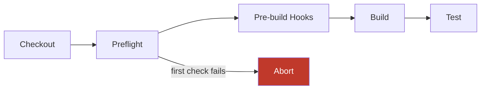

# Preflight Tests

Preflight tests are fast, fail-fast validation gates that run before expensive build and test stages,
catching configuration, environment, and integrity issues before they waste CI resources.

## Overview

A build that fails because a config file is malformed, a required tool is missing, or a script has a
syntax error has wasted the full cost of runner startup, dependency resolution, and potentially
Unity import. Preflight tests eliminate that class of failure by running cheap validations up front —
before a Unity license is acquired, before a build is dispatched, before anything expensive begins.

Preflight tests differ from test suites in two key ways:

- **Fail-fast.** The first failing check aborts the entire preflight stage. Unlike test suites, which
  collect all failures before reporting, preflight aborts immediately. One bad config file stops the
  run.
- **No Unity required.** Preflight checks are pure validation: YAML parsing, filesystem checks,
  network probes, script linting. No Unity license, no GPU, no build output.

The result is a gate that completes in under five minutes and reliably prevents the most common
class of avoidable CI failures.

## Pipeline Position

Preflight runs after checkout and before any Unity work:



If preflight fails, nothing else runs. Pre-build hooks, builds, and tests are all skipped. This is
intentional: there is no value in dispatching a build job when the configuration driving it is
invalid.

## Quick Start

Enable preflight in your orchestrator configuration with a single field:

```yaml
# .game-ci/orchestrator.yml
preflight:
  suite: .game-ci/preflight-suite.yml
```

Define the suite:

```yaml
# .game-ci/preflight-suite.yml
checks:
  - runner-health
  - config-validation
  - build-profiles
  - script-integrity
```

That is enough to catch the most common avoidable failures. Add checks incrementally as you
identify recurring failure modes.

## Built-in Checks

Orchestrator ships with 13 built-in checks covering four categories.

### Config

Validate configuration files before the pipeline commits to using them.

| ID                       | Name                         | Description                                              |
| ------------------------ | ---------------------------- | -------------------------------------------------------- |
| `pipeline-contract`      | Pipeline Contract Validation | Validates CI workflow YAML structure and required fields |
| `build-profiles`         | Build Profile Validation     | Validates build profile configs are well-formed          |
| `submodule-profiles`     | Submodule Profile Validation | Validates submodule profile configs and dependencies     |
| `config-validation`      | Config Validation            | Validates `.game-ci` configuration files                 |
| `framework-suite-config` | Framework & Suite Config     | Validates framework and test suite YAML configs          |

### Environment

Confirm the runner can support the build before the build starts.

| ID              | Name                | Description                                                 |
| --------------- | ------------------- | ----------------------------------------------------------- |
| `runner-health` | Runner Health Check | Checks disk space, required tools, and network connectivity |
| `lfs-health`    | LFS Health Check    | Validates Git LFS config, connectivity, and hydration       |

### Integrity

Verify that the repository and its supporting scripts are internally consistent.

| ID                      | Name                        | Description                                                    |
| ----------------------- | --------------------------- | -------------------------------------------------------------- |
| `preunityjob-dry-run`   | PreUnityJob Dry Run         | Runs the PreUnityJob script in dry-run mode                    |
| `script-integrity`      | Script & Manifest Integrity | Checks scripts for syntax errors and manifests for consistency |
| `health-test-discovery` | Health Test Discovery       | Discovers health test classes and validates wiring             |

### Compilation

Catch C# problems without invoking Unity.

| ID                       | Name                      | Description                                                 |
| ------------------------ | ------------------------- | ----------------------------------------------------------- |
| `csharp-heuristics`      | C# Heuristics (Changed)   | Lightweight C# analysis on changed files only               |
| `csharp-heuristics-full` | C# Heuristics (Full Repo) | Full-repo C# heuristic analysis, scoped to relevant changes |
| `cross-profile-compile`  | Cross-Profile Compile     | Verifies the project compiles across all active profiles    |

### Check Categories

Each category has a different cost profile:

| Category    | Typical duration | Unity required | When to run                      |
| ----------- | ---------------- | -------------- | -------------------------------- |
| Config      | < 5s             | No             | Always                           |
| Environment | 5–30s            | No             | Always on persistent runners     |
| Integrity   | 10–60s           | No             | Always                           |
| Compilation | 30–60s           | No             | On changed C# or profile changes |

Order your suite to run cheaper checks first. A config check that fails in two seconds prevents the
compilation check from running unnecessarily.

## Configuration

### Using Built-in Checks

Reference built-in checks by ID string:

```yaml
# .game-ci/preflight-suite.yml
checks:
  - runner-health
  - config-validation
  - build-profiles
  - submodule-profiles
  - script-integrity
  - csharp-heuristics
```

### Custom Checks

Define checks inline when you need project-specific validation:

```yaml
checks:
  - runner-health
  - id: verify-artifact-mount
    name: Artifact Mount Check
    category: environment
    run: |
      if (-not (Test-Path "D:\BuildArtifacts")) {
        Write-Error "Artifact mount D:\BuildArtifacts not present"
        exit 1
      }
    timeout: 15
  - config-validation
```

Custom check fields:

| Field      | Description                                                     | Default     |
| ---------- | --------------------------------------------------------------- | ----------- |
| `id`       | Unique identifier for this check                                | Required    |
| `name`     | Human-readable label shown in CI output                         | `id`        |
| `category` | `config`, `environment`, `integrity`, or `compilation`          | `integrity` |
| `run`      | Shell script to execute (PowerShell on Windows, bash elsewhere) | Required    |
| `timeout`  | Maximum seconds before the check is aborted and fails           | `60`        |

A check passes when its `run` script exits `0`. Any non-zero exit code is a failure, and preflight
aborts.

### Importing Community Checks

Import check packages published by the community:

```yaml
imports:
  - source: game-ci/preflight-checks-unity@1.2.0
    checks:
      - unity-license-server
      - package-cache-integrity

checks:
  - runner-health
  - unity-license-server
  - package-cache-integrity
  - config-validation
```

Imported check packages are resolved at pipeline startup. The `source` field accepts any package
reference in the format `{owner}/{repo}@{tag}`.

### Scoping Checks

Run a check only when relevant files have changed using `scope.paths`. This prevents expensive
checks from running on every push:

```yaml
checks:
  - runner-health
  - id: csharp-heuristics
    scope:
      paths:
        - Assets/**/*.cs
        - Assets/**/*.asmdef
  - id: cross-profile-compile
    scope:
      paths:
        - config/submodule-profiles/**
        - Assets/**/*.cs
      runCondition: changed
```

`runCondition` accepts:

| Value     | Behaviour                                                             |
| --------- | --------------------------------------------------------------------- |
| `always`  | Run on every execution (default)                                      |
| `changed` | Run only when scoped paths have changed since the last successful run |
| `never`   | Disable the check without removing it from the suite                  |

Use `never` to temporarily disable a check during active investigation without losing its
configuration.

## CLI Usage

Run preflight locally before pushing:

```bash
game-ci preflight
```

Target a specific suite file:

```bash
game-ci preflight --suite .game-ci/preflight-suite.yml
```

List all available built-in checks:

```bash
game-ci preflight --list
```

Run a single check by ID:

```bash
game-ci preflight --check runner-health
```

The CLI uses the same execution engine as CI. A check that passes locally passes in CI under the
same conditions.

## Continuous Improvement Cycle

A preflight suite that never changes is not doing its job. The value of preflight comes from
encoding the failure modes you have actually seen:

1. **A build fails for a preventable reason.** A missing tool, a malformed config, a broken script.
2. **Write a check for it.** Either use a built-in check that covers the case, or write a custom
   check.
3. **Add it to the suite.** The failure mode is now caught before it reaches the build stage.
4. **Review each sprint.** Remove checks that no longer apply. A check for a dependency you removed
   six months ago creates noise, not signal.

The goal is a suite where every check has caught a real failure at least once. Checks that have
never fired and address conditions that cannot arise should be removed.

## Design Principles

- **Fast.** Each check completes in under 60 seconds. The full suite completes in under 5 minutes.
  If a check regularly exceeds these bounds, it belongs in the test suite, not in preflight.
- **Fail-fast.** Preflight aborts on the first failure. This is deliberate — a failing environment
  or broken config invalidates the results of subsequent checks.
- **Cheap.** No Unity license, no GPU, no build output. Preflight runs on any machine that can run
  a shell script.
- **Extensible.** Built-in checks, custom inline checks, and community check packages all compose
  in the same suite file.
- **Scoped.** Change-detection gating ensures checks run only when their relevant files have changed,
  keeping the suite fast even as it grows.

## When to Use Preflight vs. Other Gates

| Validation type                              | Where it belongs                                     |
| -------------------------------------------- | ---------------------------------------------------- |
| Config file structure, required fields       | Preflight (`config-validation`, `pipeline-contract`) |
| Environment readiness (disk, tools, network) | Preflight (`runner-health`, `lfs-health`)            |
| Script syntax, manifest consistency          | Preflight (`script-integrity`)                       |
| Lightweight C# heuristics on changed files   | Preflight (`csharp-heuristics`)                      |
| Unity EditMode / PlayMode tests              | Test suite                                           |
| Full compilation across all platforms        | Build stage or preflight (`cross-profile-compile`)   |
| End-to-end product validation                | Test suite (built-client runs)                       |
| Profiling, performance benchmarks            | Post-build validation stage                          |

If a check requires Unity to be running, it is a test suite item. If it requires a built artifact,
it is a post-build validation item. Everything else that can be validated cheaply and quickly
belongs in preflight.

## Inputs Reference

| Input               | Description                                 | Default                    |
| ------------------- | ------------------------------------------- | -------------------------- |
| `preflightSuite`    | Path to preflight suite YAML file           | `''`                       |
| `preflightEnabled`  | Enable the preflight stage                  | `'true'` when suite is set |
| `preflightFailFast` | Abort on first check failure                | `'true'`                   |
| `preflightTimeout`  | Maximum total preflight duration in seconds | `300`                      |
