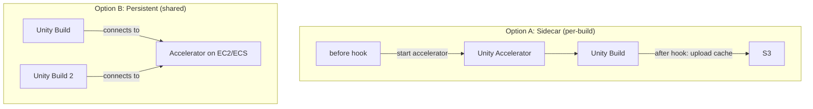

# Unity Accelerator

Unity Accelerator is a caching proxy that stores imported asset data. When Unity reimports an asset
it has seen before, the Accelerator serves the cached result instead of recomputing it. This
dramatically reduces import times for large projects — especially on cold builds where the Library
folder is empty or missing.

Orchestrator does not ship a built-in Accelerator integration, but the container hook system makes
it straightforward to add one. There are two approaches depending on your infrastructure.

## Architecture Options



| Approach       | Pros                                         | Cons                                    |
| -------------- | -------------------------------------------- | --------------------------------------- |
| **Sidecar**    | No infra to manage, works on any provider    | Must persist cache to S3 between builds |
| **Persistent** | Instant cache hits, shared across all builds | Requires always-on instance in same VPC |

## Option A: Sidecar Accelerator (per-build)

Run the Accelerator inside the build container using `before` / `after` hooks. The accelerator
starts before Unity opens, and its cache is uploaded to S3 after the build completes.

### 1. Create the hook files

Create two files in your repository under `game-ci/container-hooks/`:

**`game-ci/container-hooks/accelerator-start.yaml`**

```yaml
- name: accelerator-start
  image: ubuntu
  hook: before
  commands: |
    # Download Unity Accelerator
    apt-get update -qq && apt-get install -y -qq curl tar > /dev/null 2>&1
    ACCELERATOR_VERSION="${ACCELERATOR_VERSION:-1.0.1252+g42e1273}"
    curl -fsSL "https://accelerator.cloud.unity3d.com/api/v1/downloads/unity-accelerator-linux-x86_64-${ACCELERATOR_VERSION}.tar.gz" \
      -o /tmp/accelerator.tar.gz
    mkdir -p /opt/unity-accelerator
    tar -xzf /tmp/accelerator.tar.gz -C /opt/unity-accelerator --strip-components=1

    # Restore accelerator cache from S3 if available
    if command -v aws > /dev/null 2>&1 && [ -n "$AWS_ACCESS_KEY_ID" ]; then
      ACCEL_CACHE_PATH="s3://${AWS_STACK_NAME}/orchestrator-cache/${CACHE_KEY}/accelerator"
      aws s3 cp --recursive "$ACCEL_CACHE_PATH" /data/accelerator-cache/ 2>/dev/null || true
    fi

    # Start accelerator in background with persistent cache directory
    /opt/unity-accelerator/unity-accelerator \
      --persist-dir /data/accelerator-cache \
      --log-stdout \
      --listen-port 10080 &

    # Wait for accelerator to be ready
    for i in $(seq 1 10); do
      curl -sf http://127.0.0.1:10080/api/health && break
      sleep 1
    done

    # Export endpoint so Unity discovers it
    echo "Unity Accelerator started on 127.0.0.1:10080"
```

**`game-ci/container-hooks/accelerator-upload.yaml`**

```yaml
- name: accelerator-upload
  image: amazon/aws-cli
  hook: after
  commands: |
    # Upload accelerator cache to S3 for next build
    if [ -d "/data/accelerator-cache" ]; then
      ACCEL_CACHE_PATH="s3://${AWS_STACK_NAME}/orchestrator-cache/${CACHE_KEY}/accelerator"
      aws s3 cp --recursive /data/accelerator-cache/ "$ACCEL_CACHE_PATH" || true
      echo "Accelerator cache uploaded to $ACCEL_CACHE_PATH"
    fi
  secrets:
    - name: AWS_ACCESS_KEY_ID
      value: ${process.env.AWS_ACCESS_KEY_ID || ``}
    - name: AWS_SECRET_ACCESS_KEY
      value: ${process.env.AWS_SECRET_ACCESS_KEY || ``}
    - name: AWS_DEFAULT_REGION
      value: ${process.env.AWS_REGION || ``}
```

### 2. Configure the workflow

```yaml
- uses: game-ci/unity-builder@v4
  env:
    UNITY_EMAIL: ${{ secrets.UNITY_EMAIL }}
    UNITY_PASSWORD: ${{ secrets.UNITY_PASSWORD }}
    UNITY_SERIAL: ${{ secrets.UNITY_SERIAL }}
    UNITY_ACCELERATOR_ENDPOINT: '127.0.0.1:10080'
  with:
    providerStrategy: aws
    awsStackName: ${{ secrets.AWS_STACK_NAME }}
    targetPlatform: StandaloneLinux64
    containerHookFiles: accelerator-start,aws-s3-upload-build,accelerator-upload
    containerMemory: 16384
    containerCpu: 4096
```

### 3. How it works

1. **`accelerator-start`** (before hook) downloads, restores cache from S3, and starts the
   accelerator on port 10080
2. Unity reads `UNITY_ACCELERATOR_ENDPOINT` and routes all import requests through the local
   accelerator
3. First build: accelerator has an empty cache, imports run normally but results are cached
4. **`accelerator-upload`** (after hook) pushes the accelerator cache to S3
5. Next build: accelerator cache is restored from S3, previously imported assets resolve instantly

### Performance characteristics

| Build                         | Library behaviour                 | Accelerator behaviour                              |
| ----------------------------- | --------------------------------- | -------------------------------------------------- |
| First (cold)                  | Full reimport                     | Cache miss — stores results                        |
| Second onward                 | Partial reimport (changed assets) | Cache hit — serves stored results                  |
| After OOM / interrupted build | Library lost                      | Accelerator cache survives (separate from Library) |

The key advantage over Library caching alone: even if a build is OOM-killed and the Library cache is
lost, the accelerator cache on S3 survives. The next build still benefits from cached imports.

## Option B: Persistent Accelerator (shared instance)

For teams running frequent builds, a persistent accelerator instance provides instant cache hits
without the S3 upload/download cycle on every build.

### 1. Deploy the accelerator

Run Unity Accelerator on a small EC2 instance or ECS service in the same VPC as your Fargate tasks:

```bash
# On an EC2 instance in your build VPC
docker run -d \
  --name unity-accelerator \
  -p 10080:10080 \
  -v /data/accelerator:/persist \
  --restart unless-stopped \
  unitytechnologies/unity-accelerator:latest
```

Ensure the security group allows inbound TCP 10080 from your Fargate task security group.

### 2. Configure the workflow

Pass the accelerator's private IP or DNS name as an environment variable:

```yaml
- uses: game-ci/unity-builder@v4
  env:
    UNITY_EMAIL: ${{ secrets.UNITY_EMAIL }}
    UNITY_PASSWORD: ${{ secrets.UNITY_PASSWORD }}
    UNITY_SERIAL: ${{ secrets.UNITY_SERIAL }}
    UNITY_ACCELERATOR_ENDPOINT: '10.0.1.50:10080'
  with:
    providerStrategy: aws
    awsStackName: ${{ secrets.AWS_STACK_NAME }}
    targetPlatform: StandaloneLinux64
    containerHookFiles: aws-s3-upload-build
    containerMemory: 16384
    containerCpu: 4096
```

No hooks required — Unity connects directly to the persistent accelerator.

### 3. Considerations

- **Cost**: A `t3.medium` instance (~$30/month) is sufficient for most teams
- **Storage**: Accelerator cache grows with your asset count; use gp3 EBS with enough capacity
- **Multi-region**: Deploy one accelerator per region where your Fargate tasks run
- **Cache invalidation**: The accelerator handles this automatically based on asset hashes

## Combining with Library caching

The accelerator and Library caching are complementary:

- **Library cache** stores the fully-imported asset database — avoids reimport entirely
- **Accelerator** caches individual import results — speeds up reimports when Library is missing

For maximum performance, use both:

```yaml
containerHookFiles: accelerator-start,aws-s3-pull-cache,aws-s3-upload-build,aws-s3-upload-cache,accelerator-upload
```

This gives you:

1. Library cache restored from S3 (fast path — no reimport needed)
2. Accelerator as safety net (if Library is stale or missing, imports still resolve from cache)
3. Both caches updated after a successful build

## Troubleshooting

### Unity ignores the accelerator

Verify the environment variable name is exactly `UNITY_ACCELERATOR_ENDPOINT` (not a URL — no
`http://` prefix). The value should be `host:port` format:

```
UNITY_ACCELERATOR_ENDPOINT=127.0.0.1:10080   # correct
UNITY_ACCELERATOR_ENDPOINT=http://127.0.0.1:10080  # wrong
```

### Accelerator not reachable from Fargate

For persistent accelerator setups, ensure:

- The accelerator EC2/ECS instance is in the same VPC as your Fargate tasks
- The accelerator's security group allows inbound on port 10080 from the Fargate security group
- The Fargate task's security group allows outbound to port 10080

### Cache not persisting between builds (sidecar)

Check that the `accelerator-upload` hook runs after the build. Verify S3 permissions allow writing
to the cache path. Check the build logs for upload errors.

### Large accelerator cache slowing builds

The accelerator cache grows over time. Set a maximum cache size in the accelerator config:

```bash
/opt/unity-accelerator/unity-accelerator \
  --persist-dir /data/accelerator-cache \
  --cache-max-size 10g \
  --listen-port 10080 &
```
