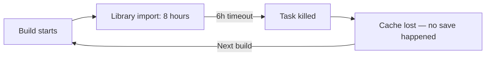
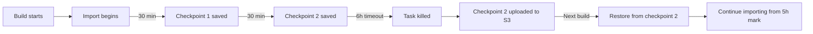

# Cache Checkpointing & Survival

For large Unity projects where the initial Library import exceeds available build time (e.g. the
6-hour GitHub Actions limit), standard caching fails — the cache is only saved after a successful
build, so interrupted builds lose all progress and start from zero every time.

Cache checkpointing solves this by saving Library state periodically **during** the build and on
failure, so each attempt makes forward progress.

## The Problem



Without checkpointing, a project that needs 8 hours of import time will **never** succeed on a
6-hour runner — it's stuck in an infinite loop of starting from scratch.

## Cache Checkpointing

Set `cacheCheckpointInterval` to save the Library folder at regular intervals during the build:

```yaml
- uses: game-ci/unity-builder@v4
  with:
    providerStrategy: aws
    targetPlatform: StandaloneLinux64
    cacheCheckpointInterval: 30
    containerMemory: 16384
```

This starts a background process that tars the Library folder every 30 minutes. If the build is
interrupted at any point, the latest checkpoint is available for the S3 upload hook to push.



### How it works

1. A background shell process runs alongside Unity
2. Every N minutes, it tars the Library folder to `/data/cache/$CACHE_KEY/Library/`
3. Only the latest 2 checkpoints are kept on disk (older ones deleted to save space)
4. If the task is killed, the `aws-s3-upload-cache` hook uploads whatever checkpoints exist
5. Next build restores from the latest checkpoint — Unity only reimports what changed since then

### Choosing an interval

| Project size     | Recommended interval | Rationale                                       |
| ---------------- | -------------------- | ----------------------------------------------- |
| < 10 GB Library  | Not needed           | Build likely completes within timeout           |
| 10-30 GB Library | 30 minutes           | Balance between I/O overhead and progress saved |
| 30-80 GB Library | 60 minutes           | Large tars take time; less frequent = less I/O  |
| > 80 GB Library  | 90 minutes           | Use with retained workspaces instead            |

## Save on Failure

For builds that might OOM or crash (rather than timeout), `cacheSaveOnFailure` installs a shell trap
that captures partial Library state on any non-zero exit:

```yaml
- uses: game-ci/unity-builder@v4
  with:
    providerStrategy: aws
    targetPlatform: StandaloneLinux64
    cacheSaveOnFailure: true
    containerMemory: 8192
```

When the build process exits with a non-zero code (OOM, crash, assertion failure), the trap:

1. Checks if a Library folder with content exists
2. Tars it to the cache directory as `recovery-partial.tar[.lz4]`
3. The upload hook then pushes it to S3

Next build restores from this partial cache. Unity skips assets that were already imported.

### When to use each

| Scenario           | Use `cacheCheckpointInterval`    | Use `cacheSaveOnFailure`         |
| ------------------ | -------------------------------- | -------------------------------- |
| Timeout (6h limit) | Yes — saves progress before kill | May not trigger (SIGKILL)        |
| OOM kill           | Checkpoints already saved        | Yes — trap catches EXIT          |
| Crash / assertion  | Checkpoints already saved        | Yes — trap catches non-zero exit |
| Normal build       | Overhead but harmless            | No-op (exit 0 skips trap)        |

**Recommendation:** Use both together for maximum resilience:

```yaml
cacheCheckpointInterval: 30
cacheSaveOnFailure: true
```

## Cache Retention

Control how long old cache entries persist on S3 with `cacheRetentionDays`:

```yaml
- uses: game-ci/unity-builder@v4
  with:
    providerStrategy: aws
    cacheRetentionDays: 14
```

After each successful cache upload, entries older than 14 days are automatically removed from the S3
bucket. This prevents unbounded cache growth for projects with many branches.

| Setting       | Effect                                         |
| ------------- | ---------------------------------------------- |
| `0` (default) | Keep cache forever (manual cleanup only)       |
| `7`           | One week retention — good for feature branches |
| `30`          | One month ��� good for main/develop branches   |
| `90`          | Three months — good for release branches       |

### Per-branch retention

Use different `cacheRetentionDays` values per workflow trigger:

```yaml
- uses: game-ci/unity-builder@v4
  with:
    cacheRetentionDays: ${{ github.ref == 'refs/heads/main' && '90' || '14' }}
```

## Combining with Unity Accelerator

Cache checkpointing and [Unity Accelerator](unity-accelerator) are complementary:

- **Checkpointing** saves the entire Library folder state periodically
- **Accelerator** caches individual asset import results

Together, they provide the fastest recovery from interrupted builds:

```yaml
- uses: game-ci/unity-builder@v4
  env:
    UNITY_ACCELERATOR_ENDPOINT: '127.0.0.1:10080'
  with:
    providerStrategy: aws
    containerHookFiles: accelerator-start,aws-s3-upload-build,aws-s3-upload-cache,accelerator-upload
    cacheCheckpointInterval: 30
    cacheSaveOnFailure: true
    cacheRetentionDays: 30
    containerMemory: 16384
```

This gives you:

1. **Checkpoint every 30 min** — progress saved even on timeout
2. **Failure trap** — partial save on OOM/crash
3. **Accelerator** — individual imports cached and survive independently
4. **Retention** — old entries cleaned after 30 days

## Inputs Reference

| Input                     | Type    | Default            | Description                              |
| ------------------------- | ------- | ------------------ | ---------------------------------------- |
| `cacheCheckpointInterval` | number  | `0` (disabled)     | Minutes between Library checkpoints      |
| `cacheSaveOnFailure`      | boolean | `false`            | Save partial cache on build failure      |
| `cacheRetentionDays`      | number  | `0` (keep forever) | Auto-delete S3 entries older than N days |
| `skipCache`               | boolean | `false`            | Skip cache restore entirely              |
| `useCompressionStrategy`  | boolean | `false`            | Use LZ4 compression for cache archives   |
| `cacheKey`                | string  | branch name        | Override cache key for isolation         |

## Troubleshooting

### Checkpoints not being saved

- Verify `cacheCheckpointInterval` is set to a value > 0
- Check container logs for `[Cache Checkpoint]` messages
- Ensure the Library folder exists at `$GITHUB_WORKSPACE/Library` (Unity must have started
  importing)
- Check disk space — checkpoints are skipped if disk is full

### Partial cache not restoring

- The upload hook must run after the task is killed. For OOM kills on AWS Fargate, the task stops
  and the hook container runs separately. For hard SIGKILL, the checkpoint files must already exist
  in `/data/cache/` from a previous checkpoint interval.
- Verify S3 contains checkpoint files: `aws s3 ls s3://<stack>/orchestrator-cache/<key>/Library/`

### Cache growing too large

- Set `cacheRetentionDays` to automatically purge old entries
- Use `useCompressionStrategy: true` to compress archives with LZ4 (~50% size reduction)
- Use branch-specific `cacheKey` values to isolate feature branch caches from main
