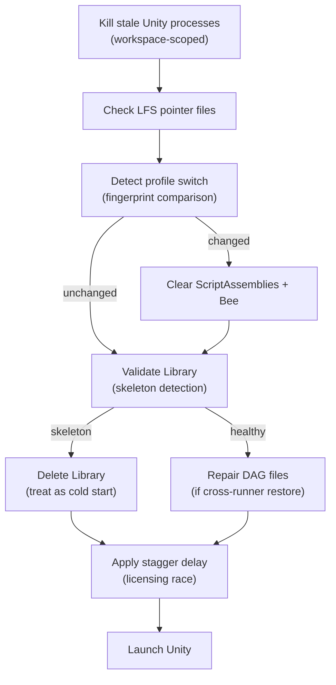

# Self-Hosting and Orchestrator

Self-hosting gives you owned build machines. Orchestrator adds the coordination layer that keeps
those machines fast, predictable, and recoverable when persistent workspaces, shared caches,
multiple runners, and multiple projects accumulate state across builds.

Aborted jobs, disk errors, concurrent engine instances, cross-runner cache restores, and oversized
local caches introduce optimization and reliability problems that ephemeral runners never
encounter. This page covers the Orchestrator patterns that address those problems across thousands
of CI runs.

The examples are Unity-heavy because Unity `Library` caching is the most common high-impact case,
but the same principles apply to Godot import caches, Unreal intermediate data, custom engine
providers, and lab machines running multiple projects.

## Library Cache Strategy

The Unity Library folder is the single largest factor in build speed. A warm Library means Unity
reimports only changed assets. A missing or corrupt Library means a full reimport that can take
hours on large projects.

### Cache Temperature

Classify Library cache state into three tiers to select the right restore strategy:

| Tier     | Description                                             | Restore cost                      |
| -------- | ------------------------------------------------------- | --------------------------------- |
| **HOT**  | Library from the same runner, same profile, same branch | Milliseconds (move)               |
| **WARM** | Library from a different runner or branch, same profile | Seconds (move + partial reimport) |
| **COLD** | No Library available — full reimport required           | Minutes to hours                  |

### Move vs Copy

On NTFS (Windows) and ext4 (Linux), moving a directory on the same volume is an O(1) metadata
operation. A 50 GB Library folder moves in milliseconds. Copying it takes minutes.

**Rule: Use Move-Item for Library restore, never Copy-Item.** The only exception is saving a shared
seed copy to a central cache directory — that copy runs off the critical path after the build
completes.

```powershell
# Restore — instant same-volume move
Move-Item -Path "D:\CI\Cache\$profile\Library" -Destination "$workspace\Library"

# Save shared seed — runs after build, off critical path
Copy-Item -Path "$workspace\Library" -Destination "D:\CI\Cache\shared\Library" -Recurse
```

### Cache Poisoning Detection

A Library that exists but contains empty or corrupt files is worse than no Library at all. Unity
treats it as a warm cache hit but then reimports everything anyway — without the safeguards applied
to a known cold start.

Validate the Library before treating it as a cache hit:

```powershell
$artifactDb = Join-Path $workspace "Library\ArtifactDB"
$assetDbInfo = Join-Path $workspace "Library\assetDatabase.info"

$isSkeleton = (-not (Test-Path $artifactDb)) -or
              ((Get-Item $artifactDb).Length -eq 0) -or
              (-not (Test-Path $assetDbInfo)) -or
              ((Get-Item $assetDbInfo).Length -eq 0)

if ($isSkeleton) {
    Write-Warning "Library is a skeleton — treating as cache MISS"
    Remove-Item -Path (Join-Path $workspace "Library") -Recurse -Force
}
```

A skeleton Library (directory structure present but content files empty or absent) should be deleted
and the build treated as a cold start.

## DAG File Repair

Unity's Bee build system stores incremental compilation state in `Library/Bee/` as DAG (directed
acyclic graph) files. These files contain absolute paths to source files and intermediate artifacts.

### The Problem

When a Library cache is restored from a different runner, the absolute paths in DAG files point to
the original runner's workspace. Bee detects the path mismatch and either rebuilds everything from
scratch (negating the cache benefit) or, worse, silently produces incorrect incremental builds.

### The Fix

After restoring a Library from a different runner, repair the DAG files by replacing the old
workspace path with the current one:

```powershell
$dagFiles = Get-ChildItem -Path "$workspace\Library\Bee" -Filter "*.dag" -Recurse
foreach ($dag in $dagFiles) {
    $content = [System.IO.File]::ReadAllText($dag.FullName)
    $repaired = $content.Replace($oldWorkspacePath, $currentWorkspacePath)
    if ($repaired -ne $content) {
        [System.IO.File]::WriteAllText($dag.FullName, $repaired)
    }
}
```

This preserves incremental compilation state across runners while correcting the path references.

### When to Repair

| Scenario                             | DAG repair needed?          |
| ------------------------------------ | --------------------------- |
| Same runner, same workspace          | No                          |
| Different runner, same volume layout | Yes                         |
| Library from shared cache            | Yes                         |
| Fresh cold import                    | No (no DAG files exist yet) |

## LFS Pointer Poisoning

Git LFS stores large files as small pointer files in the repository and hydrates them to full
content on checkout. When hydration fails silently, the pointer file remains in place of the actual
asset.

### The Problem

Unity treats `.dll` pointer files (130–200 bytes, starting with `version https://git-lfs.`) as valid
assemblies. The result is a cryptic `BadImageFormatException` or `TypeLoadException` during domain
reload — with no indication that the root cause is an unhydrated LFS file.

### Detection

Check for LFS pointer files masquerading as binary assets:

```powershell
$suspectFiles = Get-ChildItem -Path "$workspace\Assets" -Include "*.dll","*.so","*.dylib" -Recurse |
    Where-Object { $_.Length -lt 200 }

foreach ($file in $suspectFiles) {
    $header = Get-Content $file.FullName -First 1 -ErrorAction SilentlyContinue
    if ($header -match "^version https://git-lfs") {
        Write-Error "LFS pointer detected: $($file.FullName)"
    }
}
```

### Prevention

- Run LFS pointer checks before Unity launches, not after a build failure
- When a pointer is detected, run `git lfs pull` for the affected paths before proceeding
- If using a custom LFS transfer agent (such as
  [elastic-git-storage](https://github.com/frostebite/elastic-git-storage)), ensure the agent is
  configured and accessible before checkout
- Never configure `lfs.skipdownloaderrors = true` — this silently converts hydration failures into
  pointer files

## Profile Switching

Monorepos that build multiple products from the same repository need different submodule
configurations per product. When a runner switches between profiles, the Library cache from the
previous profile is invalid.

### Fingerprint-Based Cache Invalidation

Generate a fingerprint from the active profile's submodule set and scripting defines. When the
fingerprint changes between runs, invalidate caches that depend on compilation state:

```powershell
$profileContent = Get-Content $profilePath -Raw
$fingerprint = (Get-FileHash -InputStream ([IO.MemoryStream]::new(
    [Text.Encoding]::UTF8.GetBytes($profileContent)
)) -Algorithm SHA256).Hash.Substring(0, 16)

$cachedFingerprint = Get-Content "$workspace\.profile-fingerprint" -ErrorAction SilentlyContinue

if ($fingerprint -ne $cachedFingerprint) {
    Write-Output "Profile changed — clearing compilation caches"
    Remove-Item "$workspace\Library\ScriptAssemblies" -Recurse -Force -ErrorAction SilentlyContinue
    Remove-Item "$workspace\Library\Bee" -Recurse -Force -ErrorAction SilentlyContinue
    Set-Content "$workspace\.profile-fingerprint" $fingerprint
}
```

**What to clear on profile switch:**

| Cache                            | Clear? | Reason                                |
| -------------------------------- | ------ | ------------------------------------- |
| `Library/ScriptAssemblies`       | Yes    | Compiled against different defines    |
| `Library/Bee`                    | Yes    | DAG references different source files |
| `Library/PackageCache`           | Maybe  | Only if package set changed           |
| Asset imports (textures, meshes) | No     | Profile-independent, safe to reuse    |

### CI Principles for Profile Switching

- Never hardcode checks for specific submodule names, define symbols, or DLL names in CI scripts
- Use the fingerprint to detect changes generically
- Clear only what is invalidated — a full Library nuke on every profile switch wastes hours of
  reimport time

## Process Management

### Workspace-Scoped Zombie Cleanup

Persistent Windows runners can retain Unity processes after cancelled or crashed jobs. These stale
processes hold file locks on the Library folder and compete with the next Unity launch.

Scope cleanup to the current workspace path to avoid killing Unity processes belonging to other
runners on the same machine:

```powershell
$unityProcesses = Get-Process -Name "Unity" -ErrorAction SilentlyContinue |
    Where-Object {
        $_.CommandLine -match [regex]::Escape($workspacePath)
    }

foreach ($proc in $unityProcesses) {
    Write-Warning "Killing stale Unity process $($proc.Id) for workspace $workspacePath"
    Stop-Process -Id $proc.Id -Force
}

# Also clean orphaned satellite processes
$satellites = @("ILPP", "ShaderCompiler", "PackageManager", "CrashHandler", "UnityShaderCompiler")
foreach ($name in $satellites) {
    Get-Process -Name $name -ErrorAction SilentlyContinue |
        Where-Object { $_.CommandLine -match [regex]::Escape($workspacePath) } |
        Stop-Process -Force -ErrorAction SilentlyContinue
}
```

### ILPP Crash Mitigation

Unity's Incremental Live Pipeline Processing (ILPP) can crash during code compilation, especially on
cold imports or after profile switches. ILPP crashes manifest as Unity exiting with code -1 and log
entries referencing `bee_backend` or `il2cpp`.

Mitigation strategies:

- Clear `Library/Bee` before a retry — stale incremental state is the most common ILPP crash trigger
- Reduce worker count (`-workerCount 3`) to limit memory pressure during compilation
- Serialize cold imports on multi-runner machines to avoid concurrent ILPP instances competing for
  the same intermediate files

## Licensing Race Mitigation

When multiple runners on the same machine start Unity simultaneously, each instance contacts Unity's
licensing service. Concurrent license activations can fail with `Access token is unavailable` or
`Licensing is not yet initialized`.

### Stagger Delays

Add a small random delay before launching Unity on multi-runner machines:

```powershell
$staggerSeconds = Get-Random -Minimum 0 -Maximum 15
Write-Output "Stagger delay: ${staggerSeconds}s (licensing race mitigation)"
Start-Sleep -Seconds $staggerSeconds
```

### Retry Pattern

When Unity exits with code -1 shortly after launch (under 60 seconds of runtime) and the log
contains licensing messages, retry after a delay rather than clearing the Library:

```powershell
if ($exitCode -eq -1 -and $runtimeSeconds -lt 60 -and $logContainsLicensing) {
    Write-Warning "Licensing startup race detected — retrying after delay"
    Start-Sleep -Seconds 30
    # Retry Unity launch — do NOT delete the Library
}
```

A short exit with licensing errors almost never indicates Library corruption. Preserving the Library
avoids an unnecessary multi-hour reimport.

### Unity Hub Session Management

On Windows, Unity licensing requires Unity Hub to run in the interactive desktop session (Session
1), not the services session (Session 0). When Hub is restarted from a CI service context, it
launches in Session 0 and creates a "ghost" process that cannot satisfy Unity's licensing handshake.

Detect ghost Hub processes by checking the session ID:

```powershell
$hubProcess = Get-Process "Unity Hub" -ErrorAction SilentlyContinue
if ($hubProcess -and $hubProcess.SessionId -eq 0) {
    Write-Warning "Unity Hub is in Session 0 (ghost) — licensing will fail"
}
```

Restart Hub via a Windows Scheduled Task configured with `LogonType: Interactive` to ensure it
launches in Session 1. Never use `Start-Process` from a CI service context to launch Hub.

## Pre-Crash Library Backup

### The Death Spiral

When Unity crashes during a build, the Library folder may be in a partially-written state. If the
next build starts with this corrupt Library, it crashes again in the same way. Without intervention,
the runner enters a crash loop where every build fails.

### Prevention Pattern

Before launching Unity, move the current Library to a backup location. If Unity completes
successfully, delete the backup. If Unity crashes, restore the backup for the next attempt:

```powershell
$libraryPath = Join-Path $workspace "Library"
$backupPath = Join-Path $workspace "Library.backup"

# Pre-launch: back up the known-good Library
if (Test-Path $libraryPath) {
    Move-Item $libraryPath $backupPath -Force
    Move-Item $backupPath $libraryPath  # Rename back — we now have a restore point
}

# ... run Unity ...

if ($exitCode -ne 0 -and (Test-Path $backupPath)) {
    Write-Warning "Unity crashed — restoring Library backup"
    Remove-Item $libraryPath -Recurse -Force -ErrorAction SilentlyContinue
    Move-Item $backupPath $libraryPath
}
```

Use Move-Item for all Library backup operations — the Library folder is multi-gigabyte and copying
it blocks the build.

## Putting It All Together

A reliable pre-build sequence for persistent Windows runners:



## Recommended Configuration

For persistent self-hosted runners using Orchestrator:

```yaml
- uses: game-ci/unity-builder@v4
  with:
    gitIntegrityCheck: 'true'
    gitAutoRecover: 'true'
    cleanReservedFilenames: 'true'
    unityProcessCleanup: 'true'
    buildArchiveEnabled: 'true'
    buildArchivePath: '/mnt/build-archives'
    buildArchiveRetention: '5'
```

For runners not using Orchestrator, implement the patterns described on this page in your own
pre-build scripts. The key principle: validate state before Unity launches, not after it fails.
