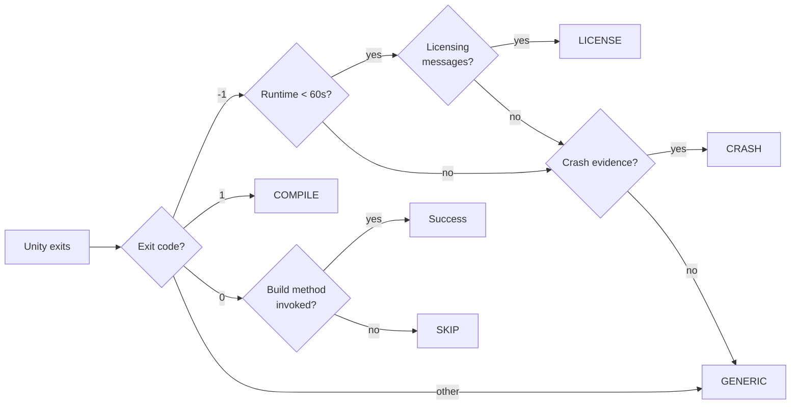
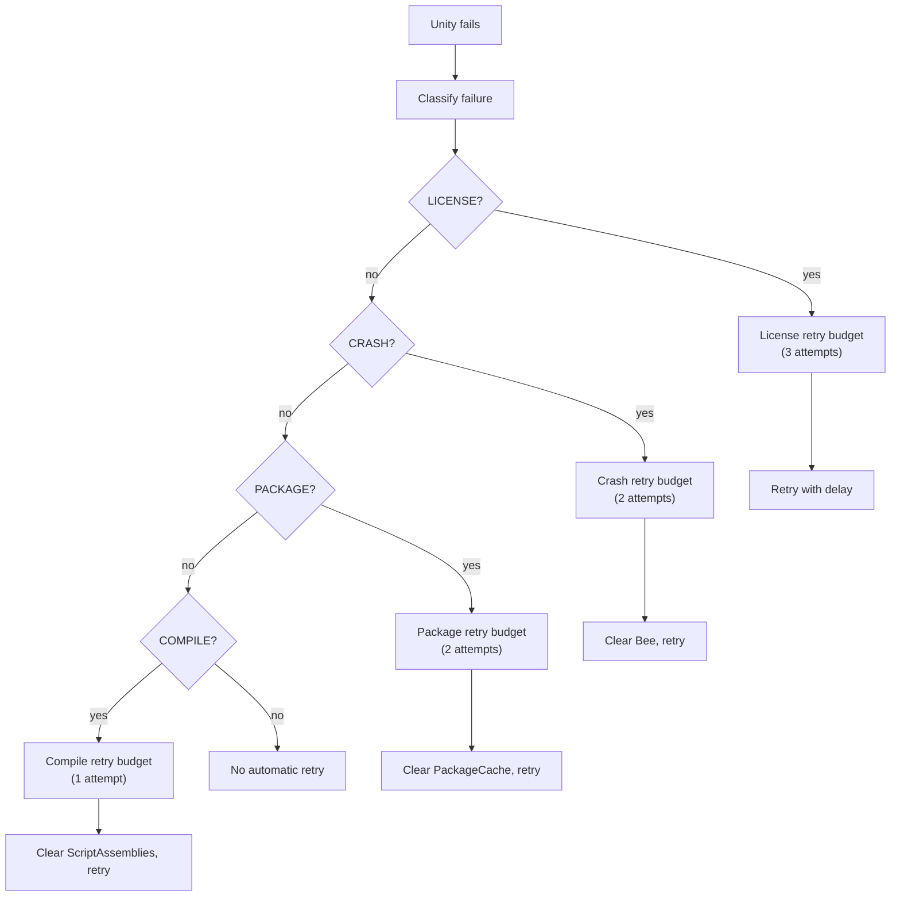

# Unity Build Failure Diagnostics

Unity CI builds fail in predictable patterns. Recognizing which failure mode you are dealing with
determines whether the correct response is a retry, a targeted cleanup, or a full cache reset. This
page documents the failure classification system, detection patterns, and remediation strategies
built into the orchestrator's diagnostics services.

## Failure Classification

Every Unity CI failure falls into one of seven categories. The diagnostics service classifies
failures by scanning the Unity Editor log for signal patterns and correlating them with the exit
code and runtime duration.



### The Seven Categories

| Category      | Exit Code | Key Signals                                                                        | Typical Cause                                                |
| ------------- | --------- | ---------------------------------------------------------------------------------- | ------------------------------------------------------------ |
| **LICENSE**   | -1        | `Access token is unavailable`, `Licensing is not yet initialized`, runtime < 60s   | Concurrent license activation, Hub in wrong session          |
| **CRASH**     | -1        | `Fatal error`, native stack trace, `Crash!!!` in log, runtime > 60s                | Memory pressure, ILPP crash, asset import failure            |
| **COMPILE**   | 1         | `Scripts have compiler errors`, `error CS`                                         | Missing assemblies, stale ScriptAssemblies, profile mismatch |
| **PACKAGE**   | 1 or -1   | `Could not restore immutable package asset`, `CS0246` under `Library/PackageCache` | Corrupt PackageCache                                         |
| **SKIP**      | 0         | Build method not invoked, no build output produced                                 | `InitializeOnLoad` timestamp race, SourceAssetDB mismatch    |
| **EXIT_NEG1** | -1        | None of the above signals, runtime > 60s                                           | Unclassified Unity failure                                   |
| **GENERIC**   | any       | No recognized signals                                                              | Unknown failure mode                                         |

### Detection Details

**LICENSE** — Unity exits -1 within 60 seconds of launch. The Editor log contains licensing-related
messages but no compilation or crash evidence. This almost always indicates a licensing startup race
on multi-runner machines, not Library corruption.

**CRASH** — Unity exits -1 after running long enough to begin asset import or compilation. The log
contains native crash evidence: stack traces with `Unity.exe!`, `Crash!!!` markers, or crash dump
references. The Library may be in a partially-written state.

**COMPILE** — Unity exits with code 1 and the log contains C# compiler errors. Common causes:
missing assembly definitions after a profile switch, stale `ScriptAssemblies` from a previous
profile, or unhydrated LFS `.dll` files.

**PACKAGE** — The log contains PackageCache-specific errors. `CS0246` errors that reference paths
under `Library/PackageCache` or messages about immutable package assets indicate a corrupt
PackageCache rather than a source code problem.

**SKIP** — Unity exits with code 0 but the build method was never invoked. This is the most
dangerous category because it masquerades as success. Old build artifacts from a previous run can
make it appear that a build succeeded when no new output was produced.

**EXIT_NEG1** — Unity exits -1 without matching any specific signal pattern. This is a catch-all for
unclassified -1 exits that need manual investigation.

**GENERIC** — Any failure that does not match the above categories. Check the Editor log directly.

## Remediation Per Category

Each category has a specific remediation that avoids unnecessary cache destruction:

| Category      | First Response                                      | Escalation                                        | What NOT to Do                               |
| ------------- | --------------------------------------------------- | ------------------------------------------------- | -------------------------------------------- |
| **LICENSE**   | Retry after 30s delay                               | Check Hub session ID                              | Do not delete Library                        |
| **CRASH**     | Clear `Library/Bee`, retry                          | Restore Library backup, retry                     | Do not immediately nuke Library              |
| **COMPILE**   | Clear `Library/ScriptAssemblies`, retry             | Check LFS pointers, then clear Library            | Do not retry without clearing assemblies     |
| **PACKAGE**   | Clear `Library/PackageCache`, retry                 | Full Library delete                               | Do not clear ScriptAssemblies (wrong target) |
| **SKIP**      | Delete SourceAssetDB + auto-generated assets, retry | Two-phase recovery (import-only pass, then build) | Do not treat exit 0 as success               |
| **EXIT_NEG1** | Read Editor log, classify manually                  | Varies                                            | Do not guess — read the log                  |
| **GENERIC**   | Read Editor log, classify manually                  | Varies                                            | Do not retry blindly                         |

### Selective Library Cleanup

Full Library deletion is expensive and should be a last resort. Target the specific subdirectory
that matches the failure:

| Symptom                              | Clear This                                 | Preserves                           |
| ------------------------------------ | ------------------------------------------ | ----------------------------------- |
| Compiler errors after profile switch | `Library/ScriptAssemblies` + `Library/Bee` | Asset imports                       |
| PackageCache GUID errors             | `Library/PackageCache`                     | Compiled assemblies + asset imports |
| Exit 0 with no build output          | `Library/SourceAssetDB`                    | Everything else                     |
| Native crash during import           | Full `Library/`                            | Nothing (last resort)               |

## Multi-Phase Retry Chains

The diagnostics service uses independent retry budgets per failure type. A licensing retry does not
consume the budget for crash recovery. This prevents a single intermittent failure from exhausting
all retry attempts.



### Retry Budget Defaults

| Category | Max Retries | Cleanup Before Retry                                  | Delay |
| -------- | ----------- | ----------------------------------------------------- | ----- |
| LICENSE  | 3           | None (preserve Library)                               | 30s   |
| CRASH    | 2           | Clear `Library/Bee` on first, full Library on second  | 10s   |
| PACKAGE  | 2           | Clear `Library/PackageCache`                          | 0s    |
| COMPILE  | 1           | Clear `Library/ScriptAssemblies` + check LFS pointers | 0s    |
| SKIP     | 1           | Delete SourceAssetDB + auto-generated assets          | 0s    |

## Circuit Breaker

When a runner fails the same build repeatedly despite retry chains, the circuit breaker prevents
infinite retry loops:

1. After exhausting all category-specific retry budgets, the build is marked as a **hard failure**
2. The failure is logged with full diagnostics (category, retry history, log excerpts)
3. The next build on the same runner starts with a full state reset (Library delete + git integrity
   check)
4. If the full reset build also fails, the runner is flagged for manual investigation

The circuit breaker resets after a successful build. A single success demonstrates the runner is
healthy and clears any accumulated failure state.

## GitHub Step Summary Integration

Build diagnostics are automatically written to the GitHub Actions Step Summary when running in a
GitHub Actions environment. The summary includes:

- Failure category and confidence level
- Key log excerpts that triggered the classification
- Recommended remediation
- Retry history (if retries were attempted)

This provides at-a-glance failure analysis in the GitHub Actions UI without requiring log downloads.

```yaml
- name: Build
  uses: game-ci/unity-builder@v4
  with:
    targetPlatform: StandaloneLinux64
    # Diagnostics are written to Step Summary automatically
```

## Using Diagnostics in Custom Scripts

The diagnostics service is available as a programmatic API for custom build scripts and provider
plugins:

```ts
import { UnityBuildDiagnosticsService, UnityRecoveryService } from '@game-ci/orchestrator';

const diagnostics = UnityBuildDiagnosticsService.analyzeRun({
  exitCode,
  runtimeSeconds,
  logText: editorLog,
  projectPath,
});

// diagnostics.category: 'LICENSE' | 'CRASH' | 'COMPILE' | 'PACKAGE' | 'SKIP' | 'EXIT_NEG1' | 'GENERIC'
// diagnostics.signals: string[]  — matched signal patterns
// diagnostics.confidence: number — 0.0 to 1.0

const decision = UnityRecoveryService.decide(
  diagnostics,
  UnityRecoveryService.createDefaultBudgets(),
);

// decision.action: 'retry' | 'escalate' | 'fail'
// decision.cleanup: string[]  — paths to clear before retry
// decision.delaySeconds: number
```

## Investigating Unclassified Failures

When a failure lands in EXIT_NEG1 or GENERIC, manual investigation is required. The diagnostics
service cannot classify what it cannot match. Follow this sequence:

1. **Pull the actual Unity Editor log** — CI wrapper output is a summary. The real failure details
   are in `Editor.log` on the runner or in the provider's build container.
2. **Search for `error`, `Error`, `CRASH`, `Fatal`** — these keywords narrow the log to relevant
   sections.
3. **Check the last 100 lines before exit** — Unity often logs the proximate cause immediately
   before shutting down.
4. **Compare with known signal patterns** — if you find a new pattern, consider adding it to the
   classification system.

:::caution

Never toggle CI features (caching, Accelerator, ILPP) to isolate an unclassified failure. Each
toggle is a wasted CI run if the theory is wrong. Diagnose from log evidence first.

:::
