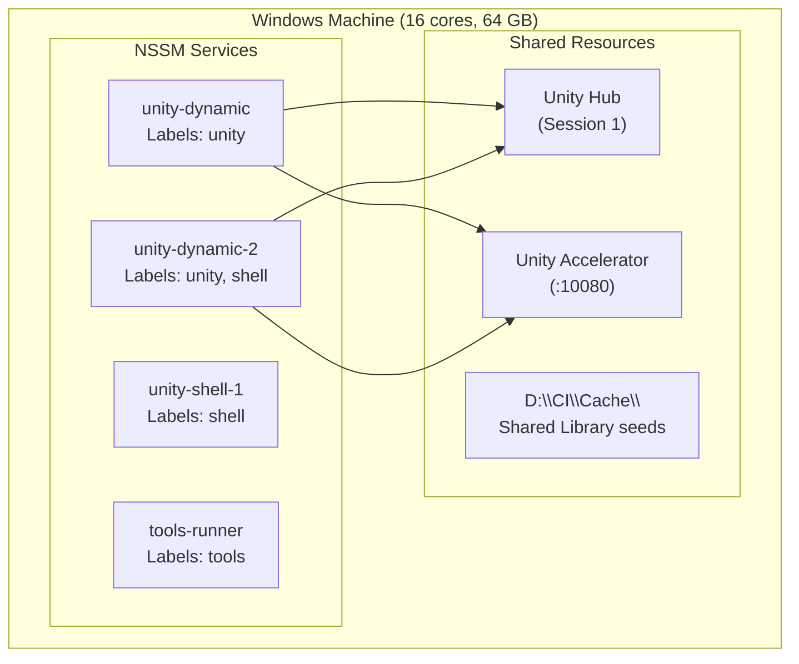

# Windows Self-Hosted Runner Setup

This guide covers setting up self-hosted GitHub Actions runners on Windows for Unity CI. It
addresses the specific challenges of running multiple runners on a single machine, managing Unity
Hub in a CI context, and configuring Unity Accelerator for persistent runners.

## Runner Topology

A single Windows machine can host multiple GitHub Actions runners, each picking up different job
types. This maximizes hardware utilization — a machine with 16 cores and 64 GB RAM can run several
Unity builds in parallel.

### Recommended Layout

Organize runners by workload type using GitHub runner labels:

| Runner            | Labels                                            | Purpose                                |
| ----------------- | ------------------------------------------------- | -------------------------------------- |
| `unity-dynamic`   | `self-hosted`, `Windows`, `X64`, `unity`          | Core Unity builds and tests            |
| `unity-dynamic-2` | `self-hosted`, `Windows`, `X64`, `unity`, `shell` | Unity + overflow shell work            |
| `unity-shell-1`   | `self-hosted`, `Windows`, `X64`, `shell`          | Validation, dispatch, SDK, maintenance |
| `tools-runner`    | `self-hosted`, `Windows`, `X64`, `tools`          | SDK tasks, standalone tests            |
| `steam-deploy`    | `self-hosted`, `Windows`, `X64`, `steam`          | Steam deployment only                  |

**Label discipline matters.** Match `runs-on` selectors in workflows to specific label combinations.
Never use bare `[self-hosted]` in `runs-on:` — it matches all runners including tools and deployment
runners, causing scheduling conflicts.

### Workspace Isolation

Each runner gets its own install directory and workspace:

```
D:\actions-runner-unity-dynamic\
  _work\
    GameClient\GameClient\    ← workspace for this runner
D:\actions-runner-unity-dynamic-2\
  _work\
    GameClient\GameClient\    ← separate workspace
D:\actions-runner-tools\
  _work\
    ...
```

Workspace isolation is essential for concurrent builds. Two runners building the same repository
must not share a workspace directory — Unity holds exclusive locks on the Library folder.

## NSSM Service Management

[NSSM](https://nssm.cc/) (Non-Sucking Service Manager) runs each GitHub Actions runner as a Windows
service that survives reboots and auto-recovers from crashes.

### Installing NSSM

```powershell
winget install NSSM.NSSM
```

### Creating a Runner Service

```powershell
$nssmPath = "C:\path\to\nssm.exe"
$runnerPath = "D:\actions-runner-unity-dynamic"
$serviceName = "GitHubRunner-unity-dynamic"

# Create service
& $nssmPath install $serviceName powershell.exe
& $nssmPath set $serviceName AppParameters "-File `"$runnerPath\run.cmd`""
& $nssmPath set $serviceName AppDirectory $runnerPath

# Configure recovery
& $nssmPath set $serviceName AppExit Default Restart
& $nssmPath set $serviceName AppRestartDelay 10000    # 10s before restart
& $nssmPath set $serviceName AppThrottle 60000        # 60s throttle between restarts
& $nssmPath set $serviceName Start SERVICE_AUTO_START

# Configure logging
& $nssmPath set $serviceName AppStdout "$runnerPath\_diag\service.log"
& $nssmPath set $serviceName AppStderr "$runnerPath\_diag\service_error.log"

# Start service
& $nssmPath start $serviceName
```

### Self-Healing Architecture

A robust runner setup uses two recovery layers:

**Layer 1 — PowerShell Wrapper.** Instead of running `Runner.Listener` directly, wrap it in a
PowerShell script that monitors the process and restarts it with exponential backoff on failure.
This handles transient crashes without involving the service manager.

```powershell
# Simplified runner wrapper pattern
$maxAttempts = 10
$attempt = 0
$backoffs = @(30, 60, 120, 240, 300)

while ($attempt -lt $maxAttempts) {
    $process = Start-Process -FilePath "$runnerPath\bin\Runner.Listener.exe" `
        -ArgumentList "run" -PassThru -Wait

    if ($process.ExitCode -eq 0) { break }  # Clean shutdown

    $delay = $backoffs[[Math]::Min($attempt, $backoffs.Length - 1)]
    Write-Output "Runner exited $($process.ExitCode) — restarting in ${delay}s"
    Start-Sleep -Seconds $delay
    $attempt++
}
```

**Layer 2 — NSSM Recovery.** When the wrapper itself exits (after exhausting restart attempts), NSSM
waits 10 seconds and restarts the wrapper fresh, resetting the attempt counter.

Together, these layers ensure runners recover from sustained outages without manual intervention.

### Common NSSM Commands

```powershell
$nssmPath = "C:\path\to\nssm.exe"

# Check status
& $nssmPath status GitHubRunner-unity-dynamic

# Restart a runner
& $nssmPath restart GitHubRunner-unity-dynamic

# Stop a runner
& $nssmPath stop GitHubRunner-unity-dynamic

# View configuration
& $nssmPath dump GitHubRunner-unity-dynamic
```

## Unity Hub Management

Unity licensing on Windows requires Unity Hub to be running in the correct Windows session. Getting
this wrong produces silent licensing failures.

### The Ghost Process Problem

When CI code restarts Unity Hub from a service context (WinRM, NSSM service, or Scheduled Task
running as SYSTEM), Hub launches in **Session 0** (the non-interactive services session) instead of
**Session 1** (the user's desktop). This creates a ghost process that:

- Is invisible on the desktop
- Cannot satisfy Unity's licensing handshake
- Causes Unity to exit with code -1 and `Licensing is not yet initialized`

### Detection

Check which session Hub is running in:

```powershell
Get-Process "Unity Hub" -ErrorAction SilentlyContinue |
    Select-Object Id, SessionId, StartTime
```

Session 1 is healthy. Session 0 is a ghost.

### Correct Restart Pattern

Restart Hub via a one-time Windows Scheduled Task configured for interactive logon:

```powershell
$hubPath = "C:\Program Files\Unity Hub\Unity Hub.exe"
$action = New-ScheduledTaskAction -Execute $hubPath
$principal = New-ScheduledTaskPrincipal `
    -UserId $env:USERNAME `
    -LogonType Interactive `
    -RunLevel Highest
$trigger = New-ScheduledTaskTrigger -Once -At (Get-Date).AddSeconds(2)

Register-ScheduledTask -TaskName "CI-HubRestart" `
    -Action $action -Principal $principal -Trigger $trigger -Force
Start-ScheduledTask -TaskName "CI-HubRestart"

# Wait for Hub to start
Start-Sleep -Seconds 10

# Verify and clean up
$hub = Get-Process "Unity Hub" -ErrorAction SilentlyContinue
if ($hub -and $hub.SessionId -eq 1) {
    Write-Output "Hub started in Session 1 (healthy)"
}
Unregister-ScheduledTask -TaskName "CI-HubRestart" -Confirm:$false
```

:::caution

Never invoke Unity Hub CLI commands (`Unity Hub.exe -- --headless`) from CI scripts. Any `Hub.exe`
invocation from a service context launches Hub in headless mode in Session 0, creating the ghost
process problem. Check Hub health by verifying the process exists with SessionId 1 — do not probe
it.

:::

## Worker Count Configuration

Unity uses worker threads for asset import and shader compilation. On machines running multiple
runners, the default worker count can cause memory pressure and ILPP crashes.

Reduce the worker count to limit per-runner resource consumption:

```yaml
# In your workflow
- uses: game-ci/unity-builder@v4
  with:
    customParameters: '-workerCount 3'
```

**Guidelines:**

| Machine Config   | Runners | Recommended `-workerCount` |
| ---------------- | ------- | -------------------------- |
| 8 cores, 32 GB   | 2       | 2                          |
| 16 cores, 64 GB  | 4       | 3                          |
| 32 cores, 128 GB | 6+      | 4                          |

Lower worker counts reduce peak memory usage and prevent concurrent ILPP instances from competing
for system resources. The trade-off is slightly longer import times per build, but fewer crashes and
more predictable scheduling.

## Unity Accelerator Setup

[Unity Accelerator](https://unity.com/products/unity-accelerator) caches asset import results. On
persistent self-hosted runners, a local Accelerator instance can serve cached imports to all runners
on the machine.

### Install

Download Unity Accelerator from
[Unity's download page](https://unity.com/products/unity-accelerator) and install it as a Windows
service.

### Configure

Set the Accelerator endpoint as an environment variable in your workflow:

```yaml
env:
  UNITY_ACCELERATOR_ENDPOINT: '127.0.0.1:10080'
```

### Cold Start Caution

Some Unity versions (affected by UUM-4003) crash when the Accelerator is enabled during a full cold
import on an empty Library. If you encounter unexplained crashes on cold builds:

1. Disable the Accelerator for cold imports (no Library present)
2. Enable it for warm builds (Library exists and passes skeleton detection)
3. Always disable it during retry attempts

```powershell
$hasLibrary = Test-Path (Join-Path $workspace "Library\ArtifactDB")
if ($hasLibrary) {
    $env:UNITY_ACCELERATOR_ENDPOINT = "127.0.0.1:10080"
} else {
    Remove-Item Env:\UNITY_ACCELERATOR_ENDPOINT -ErrorAction SilentlyContinue
}
```

## Disk Space Management

Unity projects consume substantial disk space. A single runner workspace with Library folder can
reach 50+ GB. Plan storage accordingly:

| Component           | Typical Size | Per Runner?     |
| ------------------- | ------------ | --------------- |
| Repository checkout | 5–20 GB      | Yes             |
| Unity Library       | 10–80 GB     | Yes             |
| Build output        | 1–10 GB      | Yes             |
| LFS objects         | 5–50 GB      | Shared possible |
| Accelerator cache   | 5–20 GB      | Shared          |

For a machine with 4 Unity runners, budget at least 500 GB of fast SSD storage. NVMe is recommended
for Library folder operations.

### Cleanup Strategy

- Archive and remove old build outputs on a schedule
- Clear Library folders for branches that have been merged
- Monitor disk usage and alert before builds start failing with `No space left on device`

## Putting It All Together

A complete multi-runner Windows setup:



Each runner operates independently with its own workspace, shares the Unity Hub instance and
Accelerator cache, and recovers automatically from crashes through the NSSM self-healing layers.
